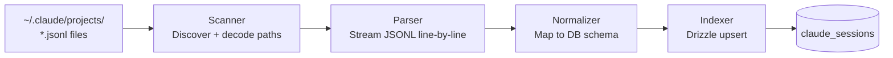
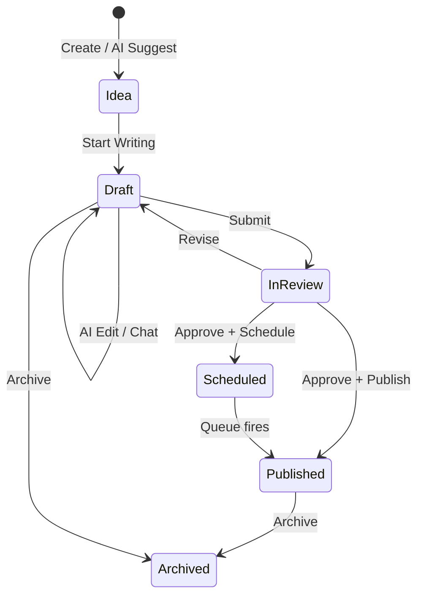

# SessionForge

> Turn your Claude Code sessions into publication-ready technical content.

SessionForge ingests JSONL session files from `~/.claude/projects/`, analyzes developer workflows through a 6-dimension weighted scoring algorithm, and orchestrates multi-agent pipelines to produce blog posts, Twitter threads, LinkedIn posts, changelogs, and newsletters -- all sourced from real coding sessions with real code snippets.

---

## Table of Contents

- [Features](#features)
- [Tech Stack](#tech-stack)
- [Architecture](#architecture)
- [Prerequisites](#prerequisites)
- [Local Setup](#local-setup)
- [Environment Variables](#environment-variables)
- [Database](#database)
- [Running the App](#running-the-app)
- [Key Concepts](#key-concepts)
- [Content Pipeline](#content-pipeline)
- [Deployment](#deployment)
- [Contributing](#contributing)

---

## Features

### Core
- **Session Scanner** -- Discovers and indexes Claude Code JSONL session files from `~/.claude/projects/`
- **Insight Extractor** -- 6-dimension weighted scoring to identify publishable content opportunities
- **Content Generation** -- Blog posts, Twitter threads, LinkedIn posts, changelogs, newsletters via AI agents
- **Lexical Editor** -- Rich text editor with edit/split/preview modes, markdown import/export
- **AI Chat Sidebar** -- Streaming AI assistant for interactive content editing
- **Evidence-Based Writing** -- Content sourced from real session transcripts with citation links

### Content Management
- **Calendar View** -- Monthly calendar with posts on dates, drag-and-drop scheduling
- **Pipeline View** -- Kanban board with Idea/Draft/In Review/Published columns
- **Publish Queue** -- Scheduled publication with streak tracking
- **Series & Collections** -- Organize content into ordered series and thematic collections
- **Batch Operations** -- Bulk export across multiple content pieces

### Publishing Integrations (7 platforms)
- **Hashnode** -- Personal access token authentication
- **Dev.to** -- API key authentication
- **Medium** -- Integration token authentication
- **Ghost** -- Self-hosted CMS with Admin API key
- **WordPress** -- Application password authentication
- **GitHub** -- OAuth for repository content enrichment
- **Twitter/LinkedIn** -- OAuth for engagement analytics and publishing

### Intelligence
- **SEO/GEO Optimization** -- Readability scoring, keyword analysis, meta tag generation, 8-item checklist
- **AI Content Recommendations** -- AI-powered suggestions for what to write next
- **AI Calendar Intelligence** -- Smart scheduling with AI-suggested time slots
- **Social Media Analytics** -- Engagement tracking (impressions, likes, shares, comments, clicks) with trend charts
- **Automation Triggers** -- Scheduled content generation via cron expressions and QStash

### Infrastructure
- **RSS/Atom Feeds** -- Per-workspace syndication feeds
- **API Keys** -- Workspace-scoped API key management
- **Writing Style Settings** -- Voice profile, tone, audience, code style, custom instructions
- **Export** -- Markdown, HTML, and packaged ZIP export
- **Docker Support** -- Multi-stage Dockerfile with Docker Compose
- **Vercel Config** -- Deployment configuration with extended function timeouts

---

## Tech Stack

| Layer | Technology |
|-------|-----------|
| Framework | Next.js 15 (App Router) + React 19 |
| Styling | Tailwind CSS 4 + shadcn/ui |
| Editor | Lexical (rich text, markdown import/export) |
| Server state | TanStack Query v5 |
| Client state | Zustand |
| Auth | better-auth (email + GitHub OAuth) |
| Database | PostgreSQL via Drizzle ORM (Neon serverless, 74 tables) |
| Queue | Upstash QStash (cron + scheduled jobs) |
| Cache | Upstash Redis |
| AI | `@anthropic-ai/claude-agent-sdk` (CLI-inherited auth) |
| AI Models | Claude Opus 4.5 (generation), Claude Haiku 4.5 (routing) |
| Deployment | Vercel |
| Monorepo | Turborepo + Bun |

---

## Architecture

### System Overview

```mermaid
graph TB
    subgraph Client["Browser"]
        UI[Next.js App Router]
        Editor[Lexical Editor]
        Calendar[Calendar / Pipeline / List Views]
    end

    subgraph Server["Next.js API Routes"]
        Auth[better-auth]
        SessionAPI[Session Routes]
        ContentAPI[Content Routes]
        AgentAPI[Agent Routes - SSE]
        IntegrationAPI[Integration Routes]
        AnalyticsAPI[Analytics Routes]
        AutomationAPI[Automation Routes]
    end

    subgraph AI["AI Layer"]
        SDK[claude-agent-sdk]
        BlogAgent[Blog Writer]
        SocialAgent[Social Writer]
        ChangelogAgent[Changelog Writer]
        ChatAgent[Editor Chat]
        InsightAgent[Insight Extractor]
        StyleAgent[Style Learner]
    end

    subgraph Data["Data Layer"]
        DB[(PostgreSQL / Neon)]
        Redis[(Upstash Redis)]
        QStash[Upstash QStash]
    end

    subgraph External["External Integrations"]
        Hashnode[Hashnode]
        DevTo[Dev.to]
        Medium[Medium]
        Ghost[Ghost CMS]
        WordPress[WordPress]
        Twitter[Twitter / X]
        LinkedIn[LinkedIn]
        GitHub[GitHub]
    end

    UI --> Auth
    UI --> SessionAPI
    UI --> ContentAPI
    UI --> AgentAPI
    UI --> IntegrationAPI
    UI --> AnalyticsAPI

    AgentAPI --> SDK
    SDK --> BlogAgent
    SDK --> SocialAgent
    SDK --> ChangelogAgent
    SDK --> ChatAgent
    SDK --> InsightAgent

    SessionAPI --> DB
    ContentAPI --> DB
    IntegrationAPI --> DB
    AnalyticsAPI --> DB
    AutomationAPI --> QStash

    IntegrationAPI --> Hashnode
    IntegrationAPI --> DevTo
    IntegrationAPI --> Medium
    IntegrationAPI --> Ghost
    IntegrationAPI --> WordPress
    IntegrationAPI --> Twitter
    IntegrationAPI --> LinkedIn
    IntegrationAPI --> GitHub
```



### Session Ingestion Pipeline



### Content Lifecycle



### Monorepo Structure

```
sessionforge/
├── turbo.json
├── package.json
├── .env.example
├── Dockerfile
├── docker-compose.yml
│
├── apps/
│   └── dashboard/                  # Next.js 15 application
│       └── src/
│           ├── app/
│           │   ├── (auth)/         # Login + signup pages
│           │   ├── (dashboard)/[workspace]/
│           │   │   ├── page.tsx              # Dashboard home
│           │   │   ├── sessions/             # Session browser
│           │   │   ├── insights/             # Ranked insights
│           │   │   ├── content/              # Content library + editor
│           │   │   │                         # (list, calendar, pipeline views)
│           │   │   ├── calendar/             # Standalone calendar
│           │   │   ├── series/               # Content series
│           │   │   ├── collections/          # Content collections
│           │   │   ├── analytics/            # Social media analytics
│           │   │   ├── recommendations/      # AI recommendations
│           │   │   ├── automation/           # Trigger management
│           │   │   ├── schedule/             # Publish queue
│           │   │   └── settings/             # Workspace, style, API keys,
│           │   │                             # integrations, skills, webhooks, wordpress
│           │   └── api/
│           │       ├── auth/                 # better-auth handler
│           │       ├── sessions/             # Scan, list, detail, messages
│           │       ├── insights/             # Extract, list, detail
│           │       ├── content/              # CRUD + supplementary + suggest-arcs
│           │       ├── agents/               # blog, social, changelog, chat (SSE)
│           │       ├── integrations/         # hashnode, devto, medium, ghost,
│           │       │                         # github, twitter, linkedin (OAuth)
│           │       ├── analytics/            # Social engagement metrics
│           │       ├── automation/           # Triggers + QStash execute
│           │       ├── schedule/             # Publish queue management
│           │       ├── series/               # Series CRUD
│           │       ├── collections/          # Collections CRUD
│           │       ├── recommendations/      # AI recommendations
│           │       ├── feed/                 # RSS/Atom feeds
│           │       └── workspace/            # Workspace settings + style
│           ├── components/
│           │   ├── ui/              # shadcn/ui base components
│           │   ├── layout/          # Sidebar, workspace selector
│           │   ├── sessions/        # Session cards, timeline, scan
│           │   ├── insights/        # Insight cards, scores
│           │   ├── content/         # Editor, AI chat, calendar, pipeline
│           │   ├── analytics/       # Charts, metric cards
│           │   └── automation/      # Trigger cards
│           └── lib/
│               ├── sessions/        # Scanner -> Parser -> Normalizer -> Indexer
│               ├── ai/              # Agents, tools, prompts, orchestration
│               ├── integrations/    # Platform clients (twitter, linkedin, etc.)
│               ├── seo/             # SEO/GEO analysis
│               ├── media/           # Diagram generation
│               └── ingestion/       # URL + repo content ingestion
│
├── packages/
│   └── db/                          # Drizzle ORM schema + client
│       └── src/schema.ts            # 59 tables, enums, relations
│
├── docs/                            # Architecture docs
└── scripts/                         # Utility scripts
```

---

## Prerequisites

- **Bun** >= 1.2.4 -- [install](https://bun.sh)
- **Node.js** >= 20 (for Next.js compatibility)
- **PostgreSQL** -- recommended: [Neon](https://neon.tech) (serverless, free tier)
- **Upstash** account -- for [Redis](https://upstash.com) and [QStash](https://upstash.com/qstash)
- **Claude Code CLI** -- logged in (AI features inherit auth from the CLI session)
- **GitHub OAuth App** (optional) -- for GitHub login

---

## Local Setup

### 1. Clone the repository

```bash
git clone https://github.com/krzemienski/sessionforge.git
cd sessionforge
```

### 2. Install dependencies

```bash
bun install
```

### 3. Configure environment variables

```bash
cp .env.example apps/dashboard/.env.local
```

Edit `apps/dashboard/.env.local` with your credentials (see [Environment Variables](#environment-variables)).

### 4. Set up the database

```bash
bun db:push
```

### 5. Start the development server

```bash
bun dev
```

Dashboard available at [http://localhost:3000](http://localhost:3000).

### 6. Create your first workspace

1. Sign up at `http://localhost:3000/signup`
2. Create a workspace (defaults to scanning `~/.claude`)
3. Click **Scan Sessions** on the Sessions page
4. Click **Extract Insights** to run the AI analysis
5. Generate content from high-scoring insights

---

## Environment Variables

Copy `.env.example` to `apps/dashboard/.env.local`.

### Database

| Variable | Description |
|----------|-------------|
| `DATABASE_URL` | PostgreSQL connection string (Neon format) |

### Authentication

| Variable | Description |
|----------|-------------|
| `BETTER_AUTH_SECRET` | Random secret for session signing (`openssl rand -base64 32`) |
| `BETTER_AUTH_URL` | App URL for OAuth callbacks (e.g., `http://localhost:3000`) |
| `GITHUB_CLIENT_ID` | GitHub OAuth App client ID (optional) |
| `GITHUB_CLIENT_SECRET` | GitHub OAuth App client secret (optional) |

### AI (Critical: Zero API Key Configuration)

**SessionForge uses `@anthropic-ai/claude-agent-sdk` which inherits authentication directly from the Claude Code CLI session. There are ZERO API keys to configure.**

The SDK spawns a `claude` subprocess that uses the logged-in user's credentials automatically. To enable AI features:
1. Install Claude Code CLI: `npm install -g @anthropic-ai/claude-code`
2. Authenticate: `claude auth login`
3. Ensure `DISABLE_AI_AGENTS` is NOT set to `"true"` (or remove it entirely)

**Important (Development):** The dev server inherits `CLAUDECODE` from the parent Claude Code session, which blocks agent execution. All 12 agent SDK files include `delete process.env.CLAUDECODE` before spawning agents. This is required for local development.

**Graceful Degradation:** Set `DISABLE_AI_AGENTS=true` to gracefully disable all AI features (endpoints return user-friendly errors). No ANTHROPIC_API_KEY, ANTHROPIC_SDK, or API setup required.

### Cache & Queue

**Redis (auto-selected):**
- `UPSTASH_REDIS_URL` + `UPSTASH_REDIS_TOKEN` → uses Upstash HTTP client
- `REDIS_URL` → uses self-hosted Redis (ioredis TCP driver)
- If neither is set, caching is disabled (app continues with degraded performance)

**QStash (queue scheduling):**

| Variable | Description |
|----------|-------------|
| `UPSTASH_QSTASH_TOKEN` | QStash publishing token |
| `UPSTASH_QSTASH_CURRENT_SIGNING_KEY` | QStash webhook signing key (current rotation) |
| `UPSTASH_QSTASH_NEXT_SIGNING_KEY` | QStash webhook signing key (next rotation) |

### Application

| Variable | Description |
|----------|-------------|
| `NEXT_PUBLIC_APP_URL` | Public URL (used in OAuth callbacks, QStash webhooks, feeds) |

---

## Database

SessionForge uses Drizzle ORM with PostgreSQL (Neon). The schema has **74 tables** covering:

| Domain | Key Tables |
|--------|-----------|
| Auth | users, auth_sessions, accounts, verifications |
| Workspaces | workspaces, style_settings, workspace_skills |
| Sessions | claude_sessions |
| Insights | insights |
| Content | posts, post_revisions, post_templates, post_evidence |
| Scheduling | scheduled_publications |
| Organization | series, series_posts, collections, collection_posts |
| Publishing | hashnode_integrations, devto_integrations, medium_integrations, ghost_integrations, wordpress_integrations, github_integrations, twitter_integrations, linkedin_integrations |
| Analytics | social_analytics_snapshots |
| Automation | content_triggers, automations |
| API | api_keys, webhooks |
| SEO | seo_metadata |
| Media | post_media, post_diagrams |
| Billing | subscriptions, stripe_webhook_events (idempotency for C1) |
| Scan Sources | scan_sources (with AES encryption for SSH credentials) |

### Commands

```bash
bun db:push       # Push schema to database (development)
bun db:generate   # Generate SQL migrations (production)
```

---

## Running the App

```bash
bun dev          # Start development server
bun build        # Production build
bun lint         # Run ESLint
```

**Critical:** Always use `next dev` (NOT `next dev --turbopack`). Turbopack has drizzle-orm relation resolution bugs in bun monorepos that cause `undefined` relation lookups. Restart the dev server after ANY route or schema changes to clear stale Turbopack caches.

---

## Key Concepts

### Workspaces

A workspace maps to a Claude session base path (default: `~/.claude`). Each workspace has its own sessions, insights, posts, style settings, and integrations.

### Insight Scoring

Each insight is scored on 6 dimensions (1-5 scale):

| Dimension | Weight | What Makes a 5 |
|-----------|--------|----------------|
| Novel Problem-Solving | 3x | Technique nobody has written about |
| Tool/Pattern Discovery | 3x | Novel MCP usage or workflow pattern |
| Before/After Transformation | 2x | Dramatic improvement with hard numbers |
| Failure + Recovery | 3x | Deep debugging, satisfying resolution |
| Reproducibility | 1x | Universal technique any developer can use |
| Scale/Performance | 1x | Hard numbers: X% faster, Y hours saved |

**Composite score** = `(novelty*3) + (tool*3) + (transform*2) + (failure*3) + (repro*1) + (scale*1)`. Maximum: **65**.

### Content Types

| Type | Description |
|------|-------------|
| `blog_post` | Long-form technical post (target: 2500 words) |
| `twitter_thread` | Multi-tweet thread with code snippets |
| `linkedin_post` | Professional narrative post |
| `devto_post` | Dev.to formatted post with frontmatter |
| `changelog` | Developer-focused changelog entry |
| `newsletter` | Newsletter section (curated insights) |
| `custom` | Free-form content |

### Post Statuses

`idea` -> `draft` -> `in_review` -> `scheduled` -> `published` -> `archived`

---

## Content Pipeline

### Manual generation

1. **Sessions** -> select a session -> **Extract Insights**
2. **Insights** -> sort by composite score -> select a high-scoring insight
3. Click **Generate Blog Post** (or Social, Changelog)
4. Review in the Lexical editor with AI Chat sidebar
5. Use **SEO tab** to optimize meta tags and readability
6. **Publish** to any connected platform or export as markdown

### Automated generation

1. Create a trigger in **Automation** with a cron expression
2. Set lookback window and content type
3. QStash calls `/api/automation/execute` on schedule
4. Sessions are scanned, insights extracted, and content drafted automatically

### Scheduling

1. Set post status to **Scheduled** with a target date
2. View scheduled posts in the **Calendar** or **Publish Queue**
3. Posts are published automatically when the scheduled time arrives

---

## Deployment

### Vercel (recommended)

1. Push this repo to GitHub
2. Import to [Vercel](https://vercel.com)
3. Set root directory to `apps/dashboard`
4. Add all environment variables
5. Set `NEXT_PUBLIC_APP_URL` to your Vercel URL

**Note:** Session scanning reads from the local filesystem (`~/.claude/`). On Vercel, use the upload feature or pair with a local scanning instance.

### Docker

```bash
docker compose up        # Development
docker compose -f docker-compose.prod.yml up  # Production
```

### Self-hosted

Any Node.js 20+ host. Build with `bun build`, start with `bun start` from `apps/dashboard`.

---

## Contributing

See [CONTRIBUTING.md](./CONTRIBUTING.md) for code style, branch conventions, and PR process.

---

## License

MIT
