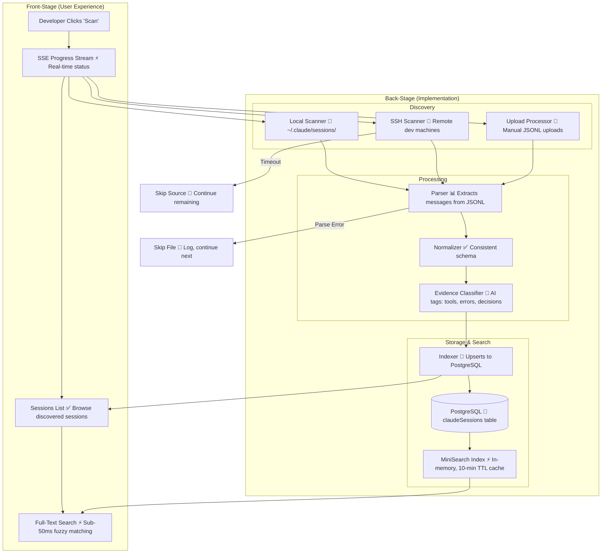

# Session Scanning Pipeline Architecture

**Type:** Architecture Diagram
**Last Updated:** 2026-03-18
**Related Files:**
- `apps/dashboard/src/lib/sessions/scanner.ts`
- `apps/dashboard/src/lib/sessions/ssh-scanner.ts`
- `apps/dashboard/src/lib/sessions/parser.ts`
- `apps/dashboard/src/lib/sessions/normalizer.ts`
- `apps/dashboard/src/lib/sessions/indexer.ts`
- `apps/dashboard/src/lib/sessions/miner.ts`
- `apps/dashboard/src/lib/sessions/evidence-classifier.ts`
- `apps/dashboard/src/lib/sessions/upload-processor.ts`

## Purpose

Shows how raw Claude Code session files become searchable, indexed knowledge — the foundation of everything SessionForge does.

## Diagram

## Key Insights

- **Three Input Sources**: Local filesystem, SSH remote, manual JSONL upload
- **Incremental Scanning**: `sinceTimestamp` avoids re-scanning; 30-day default lookback
- **Evidence Classification**: AI tags sessions with tools used, errors, decisions — powering smart content suggestions
- **Deduplication**: Upsert by session UUID — rescanning never creates duplicates
- **Sub-50ms Search**: MiniSearch in-memory index with fuzzy matching and context excerpts

## Change History

- **2026-03-18:** Initial creation
