# SessionForge System Overview

**Type:** Architecture Diagram
**Last Updated:** 2026-03-18
**Related Files:**
- `apps/dashboard/src/components/layout/workspace-shell.tsx`
- `apps/dashboard/src/lib/db.ts`
- `apps/dashboard/src/lib/auth-client.ts`
- `apps/dashboard/src/lib/ai/agent-runner.ts`
- `apps/dashboard/src/lib/redis.ts`
- `apps/dashboard/src/lib/stripe.ts`

## Purpose

Shows how SessionForge transforms a developer's Claude Code sessions into publishable content, connecting every major subsystem to the user value it delivers.

## Diagram

```mermaid
graph TB
    subgraph "Front-Stage (User Experience)"
        User[Developer Opens Dashboard]
        Sessions[Sessions Page ⚡ Browse coding history]
        Insights[Insights Page 📊 Discover patterns]
        Editor[Content Editor ⚡ Write & refine posts]
        Publish[Publish Button ✅ Go live instantly]
        Auto[Automation Page ⏱️ Set it and forget it]
        Analytics[Social Analytics 📊 Track engagement]
        Coach[Writing Coach 📊 Authenticity scoring]
        Search[Global Search ⚡ Cmd+K instant find]
        Health[System Health 🛡️ Always-visible status dot]
    end

    subgraph "Back-Stage (Implementation)"
        subgraph "Auth & Shell"
            Auth[Better Auth 🛡️ Protects user data]
            API[Next.js API Routes 🛡️ Validates all requests]
            HealthAPI[Healthcheck API ✅ DB + Redis status]
            SearchAPI[Search API ⚡ MiniSearch full-text]
        end

        subgraph "Session Scanning Pipeline"
            Scanner[Scanner + SSH 🎯 Local & remote sessions]
            Parser[Parser → Normalizer → Indexer 💾]
            Miner[MiniSearch Miner ⚡ Sub-50ms search]
        end

        subgraph "AI Agent Layer (12 agents)"
            AgentSDK[Claude Agent SDK 🎯 Inherits CLI auth]
            BlogWriter[Blog Writer 🎯 Style-matched posts]
            InsightExtractor[Insight Extractor 📊 Pattern detection]
            SocialWriter[Social Writer ⚡ Twitter & LinkedIn]
            EditorChat[Editor Chat ⏱️ Live AI assistance]
            StyleLearner[Style Learner 🎯 Matches user voice]
            CorpusAnalyzer[Corpus Analyzer 📊 Cross-session themes]
            ContentStrategist[Content Strategist 🎯 Series planning]
        end

        subgraph "Data Layer"
            Neon[(Neon PostgreSQL 💾 30 tables)]
            Redis[(Upstash Redis ⚡ Cache + rate limiting)]
            QStash[QStash ⏱️ Scheduled pipeline runs]
        end

        subgraph "Publishing (5 platforms)"
            Hashnode[Hashnode 🎯]
            WordPress[WordPress 🎯]
            DevTo[Dev.to 🎯]
            Ghost[Ghost 🎯]
            Medium[Medium 🎯]
        end
    end

    User --> Auth
    Auth --> Sessions & Insights & Editor & Auto & Analytics & Coach
    Search --> SearchAPI --> Miner
    Health --> HealthAPI

    Sessions --> Scanner --> Parser --> Neon
    Parser --> Miner
    Insights --> InsightExtractor & CorpusAnalyzer --> AgentSDK --> Neon
    Editor --> EditorChat --> AgentSDK
    Auto --> QStash --> API --> BlogWriter --> AgentSDK
    Publish --> Hashnode & WordPress & DevTo & Ghost & Medium
    API --> Redis & Neon

    Scanner -->|Error| SkipSource[Skip Source 🔄 Partial failures tolerated]
```

## Key Insights

- **Zero API Keys**: Claude Agent SDK inherits auth from CLI — no ANTHROPIC_API_KEY anywhere
- **12 AI Agents**: Blog, social, newsletter, changelog, repurpose, editor-chat, insight-extractor, corpus-analyzer, content-strategist, recommendations-analyzer, evidence-writer, style-learner
- **5 Publishing Targets**: One post reaches Hashnode, WordPress, Dev.to, Ghost, and Medium
- **Always-On Shell**: Global search (Cmd+K), system health indicator, keyboard navigation (1-5), mobile bottom nav
- **Graceful Degradation**: SSH timeouts skip source; QStash missing falls back to manual-only mode

## Change History

- **2026-03-18:** Initial creation — enhanced with audit discoveries (analytics, writing coach, global search, health indicator)
