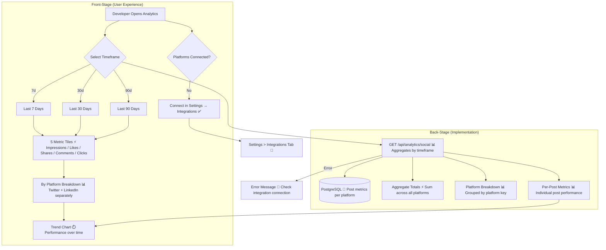

# Social Analytics Dashboard

**Type:** Feature Diagram
**Last Updated:** 2026-03-18
**Related Files:**
- `apps/dashboard/src/app/(dashboard)/[workspace]/analytics/page.tsx`
- `apps/dashboard/src/app/api/analytics/social/route.ts`
- `apps/dashboard/src/app/api/analytics/social/sync/route.ts`
- `apps/dashboard/src/app/api/analytics/metrics/route.ts`
- `apps/dashboard/src/app/api/analytics/platform-settings/route.ts`
- `apps/dashboard/src/components/analytics/trend-chart.tsx`

## Purpose

Shows developers how their published content performs across social platforms — impressions, likes, shares, comments, and clicks — helping them understand what resonates with their audience and optimize future content.

## Diagram

## Key Insights

- **5 Core Metrics**: Impressions, likes, shares, comments, and clicks — the essential engagement metrics developers care about
- **Platform Isolation**: Twitter/X and LinkedIn metrics shown separately so developers can see which platform drives the most engagement
- **Trend Visualization**: Chart shows performance over the selected timeframe — helps identify what content types perform best
- **Graceful Disconnected State**: When no social platforms are connected, shows a clear CTA to Settings > Integrations rather than empty charts
- **Sync Endpoint Available**: `/api/analytics/social/sync` exists for pulling latest metrics from connected platforms

## Change History

- **2026-03-18:** Initial creation from full functional audit
