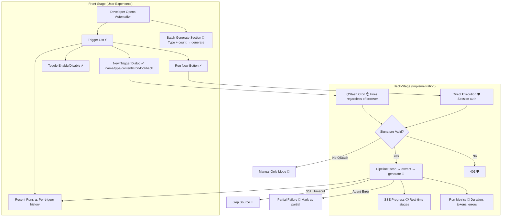

# Automation Triggers & Scheduled Content Generation

**Type:** Feature Diagram
**Last Updated:** 2026-03-18
**Related Files:**
- `apps/dashboard/src/app/(dashboard)/[workspace]/automation/page.tsx`
- `apps/dashboard/src/app/api/automation/execute/route.ts`
- `apps/dashboard/src/lib/automation/pipeline.ts`
- `apps/dashboard/src/lib/automation/cron-utils.ts`

## Purpose

Lets developers set up content generation on autopilot — configure a trigger once, and SessionForge generates posts on schedule without manual intervention.

## Diagram

## Key Insights

- **3 Trigger Types**: Scheduled (cron), File Watch (debounced), Manual
- **7 Content Types**: Blog post, Twitter thread, LinkedIn post, Dev.to article, changelog, newsletter, custom
- **Dual Auth**: QStash signature for scheduled; session auth for manual — same pipeline
- **Batch Generate**: Generate multiple posts from top insights in one click
- **Auto-Refresh**: Run list polls every 3s when active runs exist

## Change History

- **2026-03-18:** Initial creation
