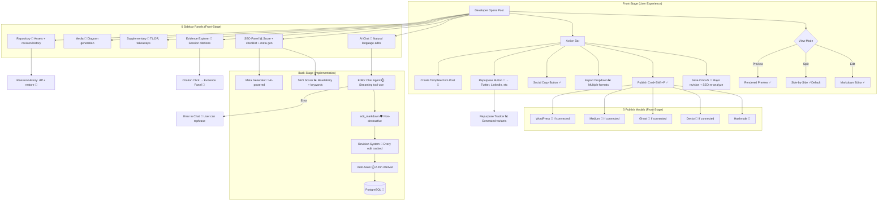

# Content Editor — Full Feature Map

**Type:** Feature Diagram
**Last Updated:** 2026-03-18
**Related Files:**
- `apps/dashboard/src/app/(dashboard)/[workspace]/content/[postId]/page.tsx`
- `apps/dashboard/src/components/editor/markdown-editor.tsx`
- `apps/dashboard/src/components/editor/ai-chat-sidebar.tsx`
- `apps/dashboard/src/components/editor/seo-panel.tsx`
- `apps/dashboard/src/components/editor/evidence-explorer.tsx`
- `apps/dashboard/src/components/editor/supplementary-panel.tsx`
- `apps/dashboard/src/components/editor/media-panel.tsx`
- `apps/dashboard/src/components/editor/repository-panel.tsx`
- `apps/dashboard/src/components/editor/revision-history-panel.tsx`
- `apps/dashboard/src/components/publish/hashnode-publish-modal.tsx`
- `apps/dashboard/src/components/publishing/devto-publish-modal.tsx`
- `apps/dashboard/src/components/publishing/ghost-publish-modal.tsx`
- `apps/dashboard/src/components/publishing/medium-publish-modal.tsx`

## Purpose

The most feature-rich page in SessionForge (28 interactions). Developers refine AI-generated drafts with live AI chat, optimize SEO, and publish to 5 platforms — all without leaving one screen.

## Diagram

## Key Insights

- **28 Unique Interactions**: Most feature-dense page — edit modes, 6 sidebar panels, 5 publish modals, keyboard shortcuts, auto-save, repurpose
- **Non-Destructive AI Edits**: Every AI edit creates a minor revision in the history — fully reversible
- **Keyboard Shortcuts**: Cmd+S saves (major revision + triggers SEO re-analyze), Cmd+Shift+P publishes
- **Resizable Panels**: Layout saved to localStorage — persists across sessions
- **5 Publishing Integrations**: Hashnode always available; Dev.to, Ghost, Medium, WordPress shown conditionally when connected
- **Citation Interactivity**: Clicking a citation in the preview scrolls the evidence panel to the matching session moment
- **Authenticity Badge**: Shows AI slop score directly on the editor page
- **Series Navigation**: If post belongs to a series, shows prev/next links

## Change History

- **2026-03-18:** Initial creation — comprehensive from audit (28 interactions mapped)
