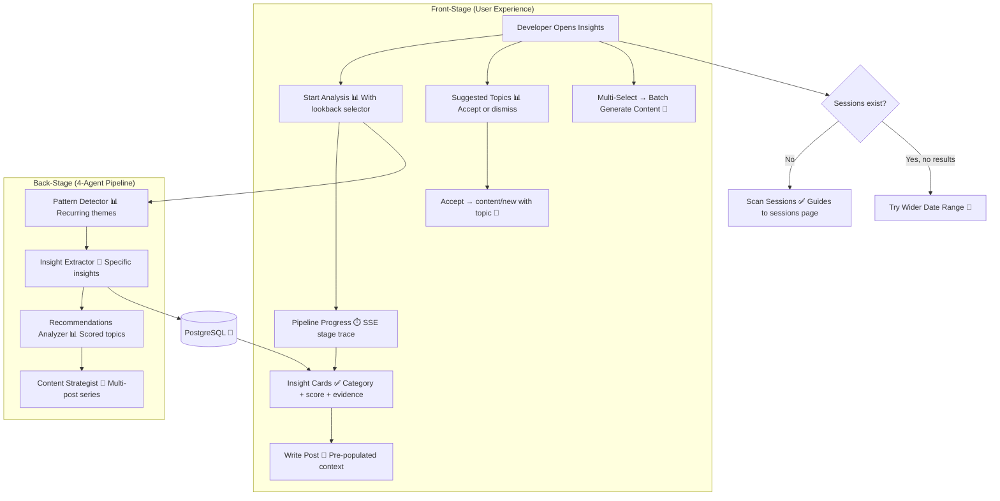

# Insights & Corpus Analysis

**Type:** Feature Diagram
**Last Updated:** 2026-03-18
**Related Files:**
- `apps/dashboard/src/app/(dashboard)/[workspace]/insights/page.tsx`
- `apps/dashboard/src/lib/ai/agents/insight-extractor.ts`
- `apps/dashboard/src/lib/ai/agents/corpus-analyzer.ts`
- `apps/dashboard/src/lib/ai/agents/content-strategist.ts`
- `apps/dashboard/src/lib/ai/agents/recommendations-analyzer.ts`

## Purpose

The intelligence layer between sessions and content — detects patterns, extracts themes, recommends topics, and plans content series from related insights.

## Diagram

## Key Insights

- **6-Dimension Scoring**: Novelty (3x), tool patterns (3x), transformation (2x), failure recovery (3x), reproducibility (1x), scale (1x) — composite out of 65
- **Recommendation Engine**: Topics ranked by priority, each with Accept (→ content/new) and Dismiss actions
- **Smart Empty States**: "No sessions" → scan CTA; "sessions but no insights" → start analysis CTA
- **Batch Content Generation**: Select multiple insights → generate content for all in one batch job

## Change History

- **2026-03-18:** Initial creation
