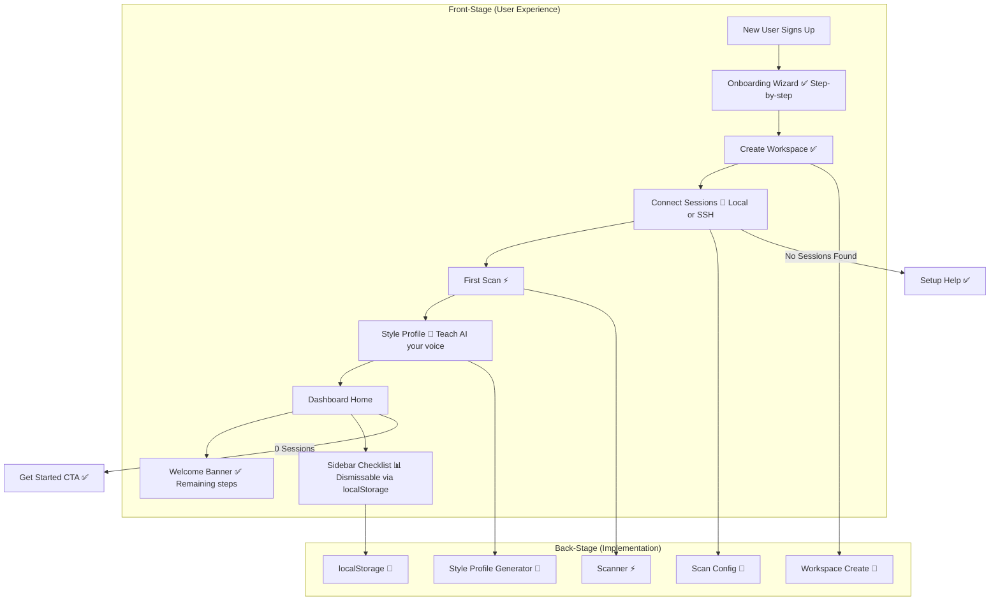

# Onboarding & Guided Setup

**Type:** Feature Diagram
**Last Updated:** 2026-03-18
**Related Files:**
- `apps/dashboard/src/app/(onboarding)/onboarding/page.tsx`
- `apps/dashboard/src/app/api/onboarding/route.ts`
- `apps/dashboard/src/components/onboarding/onboarding-checklist.tsx`
- `apps/dashboard/src/components/dashboard/welcome-banner.tsx`

## Purpose

Guides new developers through first-time setup — from signup to first scanned session — ensuring they experience value quickly.

## Diagram

## Key Insights

- **Progressive Disclosure**: Wizard reveals complexity gradually
- **Multiple Empty States**: Dashboard, Sessions, Insights pages all have onboarding-aware CTAs
- **Known Bug**: Dashboard welcome banner links to `/{workspace}/onboarding` instead of `/onboarding`

## Change History

- **2026-03-18:** Initial creation — includes audit finding about wrong onboarding link
