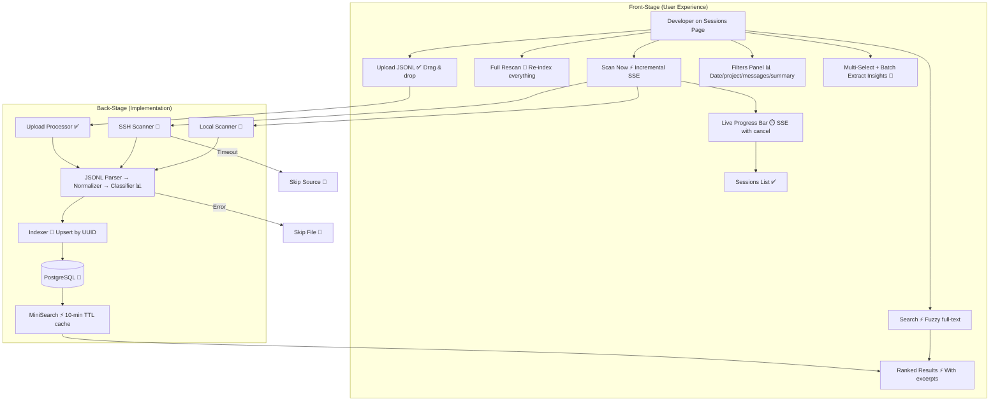

# Session Scanning & Discovery

**Type:** Feature Diagram
**Last Updated:** 2026-03-18
**Related Files:**
- `apps/dashboard/src/app/(dashboard)/[workspace]/sessions/page.tsx`
- `apps/dashboard/src/lib/sessions/scanner.ts`
- `apps/dashboard/src/lib/sessions/ssh-scanner.ts`
- `apps/dashboard/src/lib/sessions/parser.ts`
- `apps/dashboard/src/lib/sessions/normalizer.ts`
- `apps/dashboard/src/lib/sessions/indexer.ts`
- `apps/dashboard/src/lib/sessions/miner.ts`

## Purpose

Discovers and indexes Claude Code sessions from local machines, remote servers, or manual uploads — transforming raw JSONL logs into searchable knowledge.

## Diagram

## Key Insights

- **14 Interactions**: Scan (incremental + full), upload, search, filters (5 types), multi-select, batch extract, pagination, flow banner, empty states
- **Shift+Click Range Selection**: Power user feature for selecting contiguous session ranges
- **Streaming Scan Progress**: SSE shows file-by-file progress with AI analysis phase indication
- **Smart Empty States**: First visit shows "Welcome! Let's get started"; subsequent shows "No sessions found"

## Change History

- **2026-03-18:** Initial creation — enhanced with full audit interaction count
