# Writing Coach — Authenticity & Voice Analysis

**Type:** Feature Diagram
**Last Updated:** 2026-03-18
**Related Files:**
- `apps/dashboard/src/app/(dashboard)/[workspace]/writing-coach/page.tsx`
- `apps/dashboard/src/app/api/writing-coach/analytics/route.ts`
- `apps/dashboard/src/app/api/writing-coach/analyze/route.ts`
- `apps/dashboard/src/app/api/writing-coach/post/[id]/route.ts`
- `apps/dashboard/src/components/writing-coach/metrics-overview.tsx`
- `apps/dashboard/src/components/writing-coach/authenticity-trend-chart.tsx`
- `apps/dashboard/src/components/writing-coach/voice-consistency-card.tsx`
- `apps/dashboard/src/components/writing-coach/benchmark-comparison.tsx`
- `apps/dashboard/src/components/writing-coach/ai-pattern-panel.tsx`

## Purpose

Helps developers ensure their AI-generated content sounds authentically human by scoring readability, detecting AI clichés, tracking voice consistency, and providing concrete alternatives for robotic phrases.

## Diagram

```mermaid
graph TD
    subgraph "Front-Stage (User Experience)"
        User[Developer Opens Writing Coach] --> Overview[Metrics Overview ⚡ Instant quality snapshot]
        Overview --> AuthScore[Authenticity Score + Grade 📊 A-F rating]
        Overview --> VocabDiv[Vocabulary Diversity 📊 Word variety metric]
        Overview --> PassiveVoice[Passive Voice % 📊 Lower is better]
        Overview --> AIHits[AI Pattern Hits 📊 Cliché count]

        User --> TrendChart[Authenticity Trend Chart ⏱️ Score over time]
        User --> VoiceCard[Voice Consistency Card ✅ How consistent is your voice?]
        User --> Benchmark[Benchmark Comparison 📊 Your metrics vs industry averages]
        User --> AIPanel[AI Pattern Panel 🎯 Flagged phrases + better alternatives]
        User --> PostsTable[Recent Posts Table 📊 Per-post grade + top issue]
        PostsTable --> PostDetail[Post Detail View 🎯 Deep analysis of one post]
    end

    subgraph "Back-Stage (Implementation)"
        Overview --> AnalyticsAPI[Analytics API 📊 Aggregates across timeframe]
        AnalyticsAPI --> DB[(PostgreSQL 💾 Writing metrics per post)]

        AIPanel --> PatternDB[AI Pattern Database 🎯 15+ known AI clichés mapped to alternatives]

        TrendChart --> TrendData[Trend Aggregation ⏱️ Grouped by date window]

        VoiceCard --> StyleProfile[Style Profile 🎯 Learned from user's writing samples]
    end

    AnalyticsAPI --> AuthScore
    AnalyticsAPI --> VocabDiv
    AnalyticsAPI --> PassiveVoice
    AnalyticsAPI --> AIHits
    TrendData --> TrendChart

    User -->|Click Analyze All| AnalyzeAPI[Analyze Endpoint 🎯 Batch post analysis]
    AnalyzeAPI --> DB
    AnalyzeAPI -->|Success| RefreshView[Auto-Refresh Analytics ⚡ Updates after 5s]
```

## Key Insights

- **AI Cliché Detection**: Flags 15+ known AI tells ("delve into", "cutting-edge", "robust", "leverage") with concrete human alternatives
- **Authenticity Grading**: A-F grades based on composite score — readability + vocab diversity + passive voice + AI pattern avoidance
- **Benchmark Comparison**: Shows how the user's writing compares to industry averages across 4 dimensions
- **Voice Consistency Tracking**: Measures how consistent the writing voice is across posts — detects drift from the user's learned style profile
- **Analyze All Posts**: Wired to `POST /api/writing-coach/analyze` — fires and forgets analysis, auto-refreshes dashboard after 5 seconds

## Change History

- **2026-03-18:** Initial creation from full functional audit
