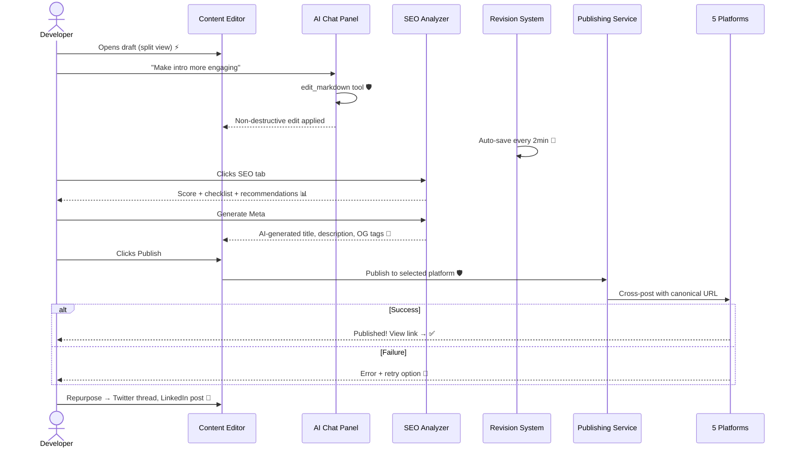

# From Draft to Published Post

**Type:** Sequence Diagram
**Last Updated:** 2026-03-18
**Related Files:**
- `apps/dashboard/src/app/(dashboard)/[workspace]/content/[postId]/page.tsx`
- `apps/dashboard/src/lib/ai/agents/editor-chat.ts`
- `apps/dashboard/src/lib/seo/scoring.ts`
- `apps/dashboard/src/lib/publishing/hashnode.ts`

## Purpose

Shows the editing and publishing journey — AI-assisted refinement, SEO optimization, and multi-platform publishing.

## Diagram

## Key Insights

- **Non-Destructive AI Edits**: `edit_markdown` creates minor revisions — every change tracked and reversible
- **2-Minute Auto-Save**: Maximum data loss boundary
- **5 Publish Targets**: Hashnode, WordPress, Dev.to, Ghost, Medium — all with canonical URLs
- **Repurposing**: One blog post transforms into Twitter threads, LinkedIn posts, newsletters, changelogs

## Change History

- **2026-03-18:** Initial creation
