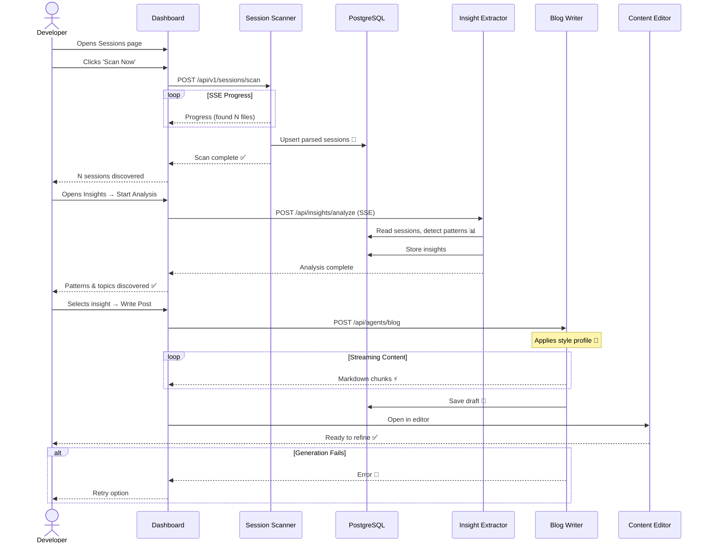

# From Sessions to Published Content

**Type:** Sequence Diagram
**Last Updated:** 2026-03-18
**Related Files:**
- `apps/dashboard/src/lib/sessions/scanner.ts`
- `apps/dashboard/src/lib/ai/agents/insight-extractor.ts`
- `apps/dashboard/src/lib/ai/agents/blog-writer.ts`
- `apps/dashboard/src/app/api/content/mine-sessions/route.ts`

## Purpose

Traces the core value proposition: from scanning coding sessions to having a publishable blog post in 3 clicks.

## Diagram

## Key Insights

- **3-Click Path**: Scan → Analyze → Write Post
- **Style Matching**: Blog writer applies learned style profile
- **Live Streaming**: Content generation streams via SSE in real-time
- **Evidence-Based**: Posts include citations back to session moments

## Change History

- **2026-03-18:** Initial creation
