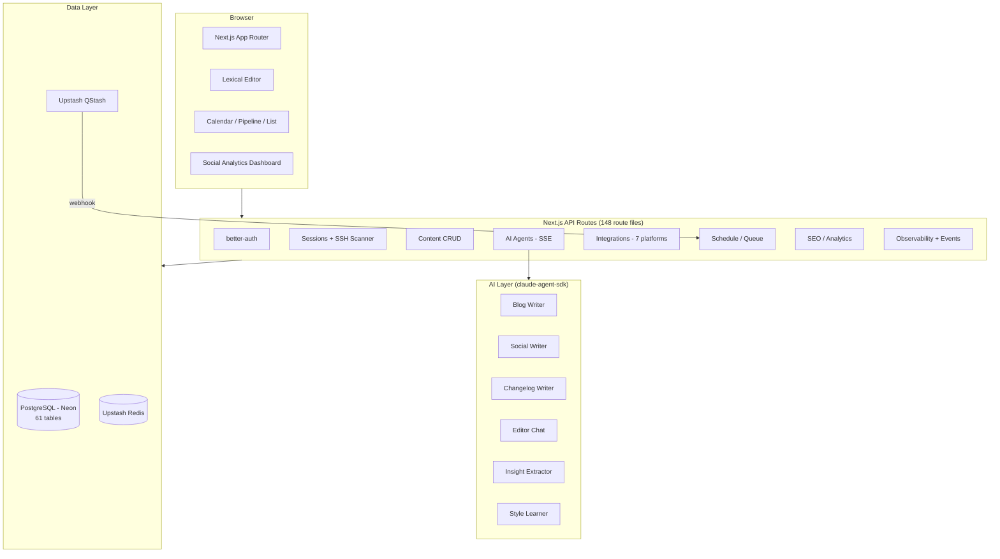
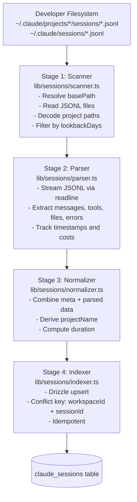
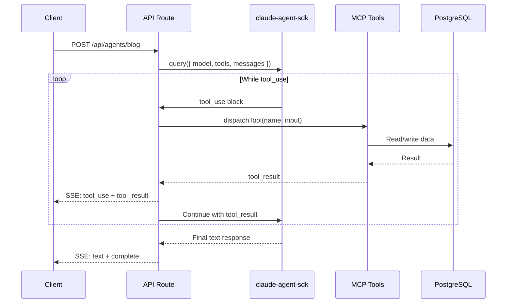
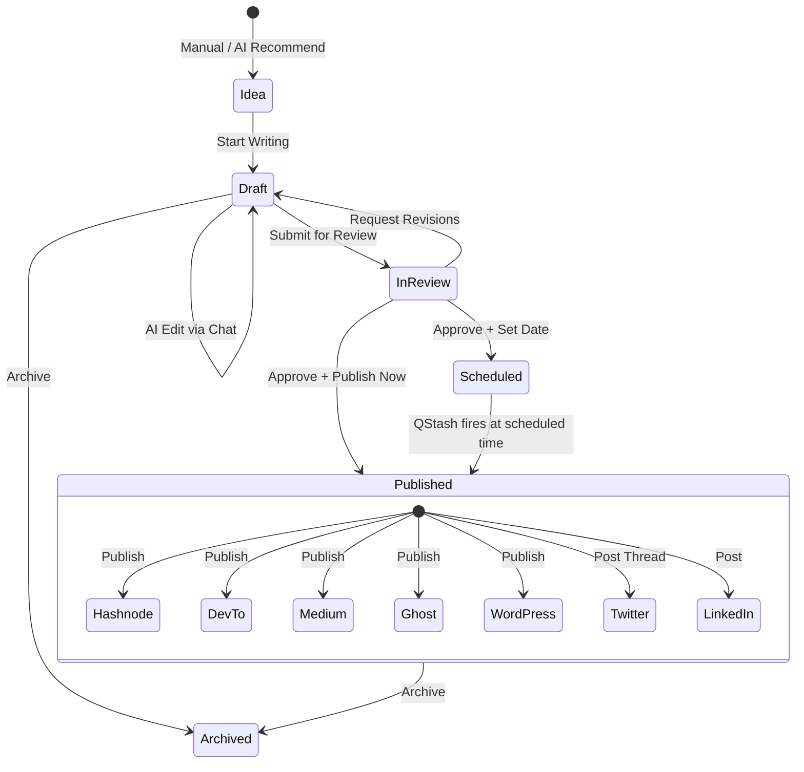
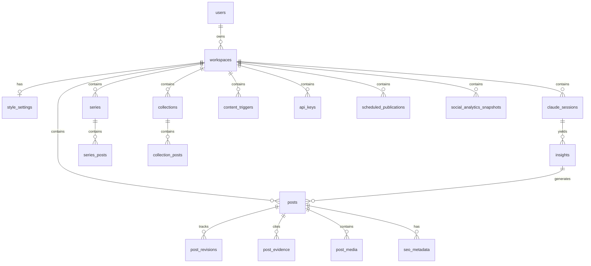
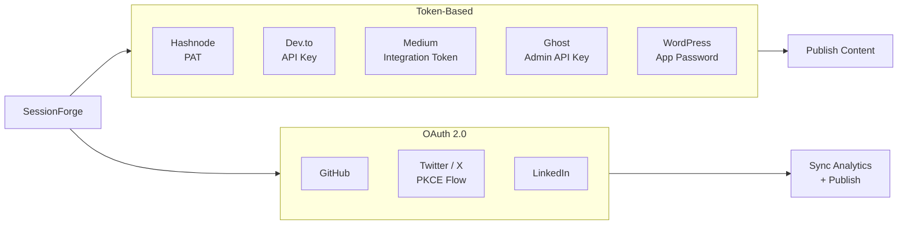

# SessionForge Architecture

**Version:** 0.5.2-alpha
**Updated:** 2026-03-10

---

## Table of Contents

1. [System Overview](#system-overview)
2. [Monorepo Structure](#monorepo-structure)
3. [Tech Stack](#tech-stack)
4. [Session Scanning Pipeline](#session-scanning-pipeline)
5. [AI Agent Pipeline](#ai-agent-pipeline)
6. [Unified Analysis Pipeline](#unified-analysis-pipeline)
7. [Shared Modules](#shared-modules)
8. [Content Lifecycle](#content-lifecycle)
9. [Database Schema](#database-schema)
10. [Navigation & UI](#navigation--ui)
11. [API Routes](#api-routes)
12. [Integration Architecture](#integration-architecture)
13. [Automation & Pipeline Visualization](#automation--pipeline-visualization)
14. [Key Design Decisions](#key-design-decisions)

---

## System Overview



---

## Monorepo Structure

Turborepo monorepo managed with Bun. All application code lives in `apps/`, shared packages in `packages/`.

```
sessionforge/
├── turbo.json
├── package.json
├── .env.example
├── Dockerfile / docker-compose.yml
│
├── apps/
│   └── dashboard/                      # Next.js 15 (App Router)
│       └── src/
│           ├── app/
│           │   ├── (auth)/             # Login / signup
│           │   ├── (dashboard)/[workspace]/
│           │   │   ├── sessions/       # Session browser + SSH scanner
│           │   │   ├── insights/       # Ranked insights
│           │   │   ├── content/        # Library + editor (list/calendar/pipeline)
│           │   │   ├── analytics/      # Social media analytics
│           │   │   ├── automation/     # Trigger management + pipeline runs
│           │   │   ├── observability/  # Pipeline status + visualization
│           │   │   └── settings/       # General, Style, API Keys,
│           │   │                       # Integrations, Webhooks, Sources
│           │   └── api/                # 148 route files
│           ├── components/             # React components
│           └── lib/
│               ├── sessions/           # Scanner -> Parser -> Normalizer -> Indexer
│               ├── ai/                 # Agents, tools, prompts, orchestration
│               ├── integrations/       # Platform clients
│               ├── seo/               # SEO/GEO analysis
│               ├── media/             # Diagram generation
│               └── ingestion/         # URL + repo content ingestion
│
└── packages/
    └── db/                             # Drizzle ORM schema + client
        └── src/schema.ts               # 61 tables, enums, relations
```

---

## Tech Stack

| Layer | Technology |
|---|---|
| Frontend | Next.js 15 (App Router) + React 19 + Tailwind CSS 4 |
| UI Library | shadcn/ui + flat-black design tokens |
| Editor | Lexical (rich text, markdown import/export) |
| Server State | TanStack Query v5 |
| Client State | React Context + useState |
| Auth | better-auth (email + GitHub OAuth) |
| Database | PostgreSQL via Drizzle ORM (Neon serverless) |
| Queue | Upstash QStash (scheduled job execution) |
| Cache | Upstash Redis (scan results, rate limits) |
| AI | `@anthropic-ai/claude-agent-sdk` (CLI-inherited auth, zero API keys) |
| AI Models | Claude Opus 4.5 (generation), Claude Haiku 4.5 (routing/classification) |
| Deployment | Vercel (frontend + serverless API routes) |
| Package Manager | Bun + Turborepo |

---

## Session Scanning Pipeline

The pipeline converts session data from multiple sources into structured database records.

### Local JSONL Pipeline



### SSH Session Scanner

`lib/sessions/ssh-scanner.ts` — Discovers and scans Claude sessions on remote SSH servers:
- SSH connection with key-based auth
- Find sessions in `~/.claude/projects/*/sessions/` and `~/.claude/sessions/`
- Stream JSONL files over SSH
- Parse and index into local database
- Configured via Settings > Sources tab

**Trigger points:**
- **Manual:** POST `/api/sessions/scan` from dashboard
- **Upload:** Drag-drop JSONL files on Sessions page
- **SSH Scan:** POST `/api/scan-sources/` from Sources settings
- **Scheduled:** Cron via QStash -> POST `/api/automation/execute`

---

## AI Agent Pipeline

All agents use `@anthropic-ai/claude-agent-sdk`, which inherits authentication from the Claude Code CLI session. **No API keys needed.**

### Agent Overview

| Agent | Route | Model | Output | Tools |
|---|---|---|---|---|
| `insight-extractor` | POST `/api/insights/extract` | Haiku | JSON | session, insight |
| `blog-writer` | POST `/api/agents/blog` | Opus | SSE stream | session, insight, post, skill |
| `social-writer` | POST `/api/agents/social` | Opus | SSE stream | session, insight, post |
| `changelog-writer` | POST `/api/agents/changelog` | Haiku | SSE stream | session, post |
| `newsletter-writer` | POST `/api/agents/newsletter` | Opus | SSE stream | session, post |
| `repurpose-writer` | POST `/api/agents/repurpose` | Opus | SSE stream | post, markdown |
| `evidence-writer` | POST `/api/agents/evidence` | Opus | SSE stream | session, post |
| `editor-chat` | POST `/api/agents/chat` | Opus | SSE stream | post, markdown |
| `content-strategist` | Internal | Opus | JSON | analytics, session analysis |
| `corpus-analyzer` | Internal | Opus | JSON | session corpus analysis |
| `recommendations-analyzer` | Internal | Opus | JSON | performance analysis |
| `style-learner` | Internal | Opus | JSON | workspace style analysis |

### Agentic Loop Pattern



### Tool Registry

`lib/ai/orchestration/tool-registry.ts` controls tool access per agent:

| Tool Set | Tools Exposed |
|---|---|
| `session` | `get_session_summary`, `get_session_messages`, `list_sessions_by_timeframe` |
| `insight` | `get_insight_details`, `get_top_insights`, `create_insight` |
| `post` | `create_post`, `update_post`, `get_post`, `get_markdown` |
| `markdown` | `edit_markdown`, `insert_section`, `replace_section` |
| `skill` | `list_available_skills`, `get_skill_by_name` |

### SSE Event Types

```
event: status       { phase, message }
event: tool_use     { tool, input }
event: tool_result  { tool, success, error? }
event: text         { content }
event: complete     { usage }
event: error        { message }
```

---

## Unified Analysis Pipeline

The **Unified Analysis Pipeline** coordinates session scanning, corpus analysis, and content generation into a single workflow. Triggered from the Insights page via "Start Analysis" button or from automation triggers.

### Pipeline Architecture

```
POST /api/pipeline/analyze
↓
Route creates run record (source: "manual" or trigger-initiated)
↓
Stream progress events via SSE
↓
executePipeline({ runId, workspace, lookbackDays, onProgress })
  ├─ SCANNING STAGE: Scan local + SSH sources in parallel
  │  ├─ scanSessionFiles() — Discover JSONL in ~/.claude
  │  ├─ scanRemoteSessions() — SSH source discovery
  │  ├─ Parse + normalize in batches (50 files per batch)
  │  └─ indexSessions() — Upsert to DB
  │
  ├─ EXTRACTING STAGE: Analyze session corpus holistically
  │  ├─ analyzeCorpus() — Claude Opus agent
  │  ├─ Corpus Analysis Prompt — Identify cross-session patterns
  │  ├─ Quality gate: composite score >= 15 (weighted 6-dimension scoring)
  │  └─ create_insight tool — Agent calls to record patterns
  │
  └─ GENERATING STAGE: Generate content from extracted insights
     ├─ generateContent() — Invoke content writer agents
     ├─ Use newInsightIds from extraction phase
     └─ Create post record and return postId
↓
Update run record (status, duration, counts)
↓
Fire automation.completed webhook
```

### Frontend Integration

**Hook:** `useAnalysisPipeline(workspaceSlug)`
- Manages SSE connection, event buffering, and state
- Exposes `startAnalysis(lookbackDays?)`, `cancel()`, and state: `{ events, currentStage, isRunning, error, result }`

**Component:** `PipelineProgress`
- Renders 3-stage timeline (Scanning → Extracting → Generating)
- Shows real-time event messages and result summary
- Error detail display on failure
- Duration counter on completion

### Corpus Analysis (Extraction Phase)

Enhanced analysis prompt (`lib/ai/prompts/corpus-analysis.ts`) instructs Claude Opus to:

1. **Survey Phase** (1-2 turns): Call `list_sessions_by_timeframe` once, scan for top 5 sessions by:
   - High message counts (deep work)
   - Many errors (debugging stories)
   - Many files (major refactors)
   - Temporal clustering (intensity indicator)

2. **Deep-Dive Phase** (5-8 turns): Call `get_session_summary` on top 5 picks, `get_session_messages` on 2-3 most promising

3. **Create Insights Phase** (remaining turns): Call `create_insight` for each cross-session pattern (target 3-5 insights)

### Quality Gate Scoring

Each insight is scored across 6 weighted dimensions:

| Dimension | Weight | Scale | Meaning |
|---|---|---|---|
| `novelty` | 3 | 0-10 | How novel/surprising? |
| `tool_discovery` | 3 | 0-10 | Creative tool usage? |
| `before_after` | 2 | 0-10 | Clear transformation? |
| `failure_recovery` | 3 | 0-10 | Interesting recovery arc? |
| `reproducibility` | 1 | 0-10 | Can others reproduce? |
| `scale` | 1 | 0-10 | Real-world applicability? |

**Composite = (novelty×3) + (tool_discovery×3) + (before_after×2) + (failure_recovery×3) + (reproducibility×1) + (scale×1)**
- Max possible: 130 (capped at 65)
- **Threshold: >= 15 to publish**

### Lookback Window

Default: 90 days (configurable per manual run or automation trigger)

Mappings:
- `current_day` → 1 day
- `last_7_days` → 7 days
- `last_30_days` → 30 days
- `last_90_days` → 90 days
- `all_time` → 36500 days

### Database State

Tracks in `automation_pipeline_runs` table:
- `status` — pending, scanning, extracting, generating, complete, or failed
- `sessionsScanned` — Count of indexed sessions
- `insightsExtracted` — Count of created insights
- `postId` — Generated content ID (if applicable)
- `durationMs` — Total execution time
- `errorMessage` — Error detail (if failed)

---

## Shared Modules

**Core utilities** extracted to reduce duplication across components and pages:

| Module | Exports | Used By |
|---|---|---|
| `lib/pipeline-status.ts` | `RunStatus`, `PipelineRun`, `statusBadgeClass()`, `statusLabel()` | Automation + Observability pages |
| `lib/content-constants.tsx` | `STATUS_COLORS`, `TYPE_LABELS`, `STATUS_TABS`, `SeoScoreBadge` | Content page, list view, card components |

**Content page components** (src/components/content/):
- `ExportPanel` — Export + batch operations
- `ContentListView` — Filtered post list with status tabs
- `CalendarView` — Monthly calendar grid
- `PipelineView` — Kanban-style columns

---

## Content Lifecycle



### Content Views

| View | Description |
|---|---|
| **List** | All posts with status tabs (All/Ideas/Drafts/In Review/Published/Archived), streak indicator, series/collection filtering |
| **Calendar** | Monthly grid with posts on dates, Published/Draft/AI Suggested Slot legend |
| **Pipeline** | Kanban board: Idea → Draft → In Review → Published columns with drag-and-drop |

---

## Database Schema

61 tables in PostgreSQL via Drizzle ORM. Schema at `packages/db/src/schema.ts`.

### Entity Relationship (Key Tables)



### Post Status Enum

`draft` | `published` | `archived` | `idea` | `in_review` | `scheduled`

### Insight Categories

`novel_problem_solving` | `tool_pattern_discovery` | `before_after_transformation` | `failure_recovery` | `architecture_decision` | `performance_optimization`

---

## Navigation & UI

### Sidebar (Desktop)
**Main nav:** Dashboard → Sessions → Insights → Content → Analytics → Automation → Pipeline (Observability)
**Settings:** Settings (gear icon, bottom)

### Mobile Bottom Nav (4 items + More sheet)
**Bottom bar:** Home → Sessions → Content → Automation → More (button)
**More sheet:** Insights, Analytics, Pipeline (Observability), Settings

### Middleware Redirects (Legacy route support)
- `/[workspace]/series` → `/[workspace]/content?filter=series`
- `/[workspace]/collections` → `/[workspace]/content?filter=collections`
- `/[workspace]/recommendations` → `/[workspace]/insights`
- `/[workspace]/settings/style` → `/[workspace]/settings?tab=style`
- `/[workspace]/settings/api-keys` → `/[workspace]/settings?tab=api-keys`
- `/[workspace]/settings/integrations` → `/[workspace]/settings?tab=integrations`
- `/[workspace]/settings/webhooks` → `/[workspace]/settings?tab=webhooks`
- `/[workspace]/settings/wordpress` → `/[workspace]/settings?tab=integrations`

---

## API Routes

148 route files under `apps/dashboard/src/app/api/`.

### Core Routes

| Method | Path | Description |
|---|---|---|
| GET/POST | `/api/sessions` | List / scan sessions |
| GET | `/api/sessions/[id]` | Session detail |
| GET | `/api/sessions/[id]/messages` | Raw transcript |
| GET/POST | `/api/insights` | List / extract insights |
| GET/POST/PUT/DELETE | `/api/content` | Content CRUD |
| POST | `/api/agents/blog` | Blog generation (SSE) |
| POST | `/api/agents/social` | Social content (SSE) |
| POST | `/api/agents/changelog` | Changelog (SSE) |
| POST | `/api/agents/chat` | Editor chat (SSE) |

### Scheduling & Automation

| Method | Path | Description |
|---|---|---|
| GET/POST | `/api/schedule` | Publish queue management |
| GET/POST | `/api/automation/triggers` | Trigger CRUD |
| GET/POST | `/api/automation/runs` | Pipeline run tracking |
| POST | `/api/automation/execute` | QStash webhook endpoint |
| GET | `/api/content/streak` | Publishing streak data |

### Observability & Events

| Method | Path | Description |
|---|---|---|
| GET | `/api/observability/stream` | SSE stream for real-time pipeline events |
| GET | `/api/observability/events` | Query historical observability events |

### Scan Sources

| Method | Path | Description |
|---|---|---|
| GET/POST | `/api/scan-sources` | List, add SSH scan sources |
| PUT/DELETE | `/api/scan-sources/[id]` | Update, delete source |
| POST | `/api/scan-sources/[id]/check` | Test source connectivity |

### Cron

| Method | Path | Description |
|---|---|---|
| POST | `/api/cron/automation` | Process all triggers (cron runner) |

### Integrations

| Method | Path | Description |
|---|---|---|
| GET/POST/DELETE | `/api/integrations/devto` | Dev.to API key |
| POST | `/api/integrations/devto/publish` | Publish to Dev.to |
| GET/POST/DELETE | `/api/integrations/medium` | Medium token |
| GET | `/api/integrations/medium/oauth` | Medium OAuth initiation |
| GET | `/api/integrations/medium/callback` | Medium OAuth callback |
| POST | `/api/integrations/medium/publish` | Publish to Medium |
| GET/POST/DELETE | `/api/integrations/ghost` | Ghost Admin API |
| POST | `/api/integrations/ghost/publish` | Publish to Ghost |
| GET/DELETE | `/api/integrations/github` | GitHub OAuth |
| GET | `/api/integrations/github/repos` | List GitHub repos |
| POST | `/api/integrations/github/sync` | Sync GitHub data |
| GET/DELETE | `/api/integrations/twitter` | Twitter OAuth |
| GET | `/api/integrations/twitter/oauth` | Twitter OAuth initiation |
| GET | `/api/integrations/twitter/callback` | Twitter OAuth callback |
| GET/DELETE | `/api/integrations/linkedin` | LinkedIn OAuth |
| GET | `/api/integrations/linkedin/oauth` | LinkedIn OAuth initiation |
| GET | `/api/integrations/linkedin/callback` | LinkedIn OAuth callback |
| GET/PUT | `/api/workspace/[slug]/integrations` | Hashnode PAT (via workspace settings) |

### Analytics & Content Intelligence

| Method | Path | Description |
|---|---|---|
| GET | `/api/analytics` | Social engagement metrics |
| GET | `/api/analytics/social` | Social media performance stats |
| POST | `/api/analytics/social/sync` | Sync social analytics |
| GET/POST | `/api/series` | Series CRUD |
| GET/POST | `/api/collections` | Collections CRUD |
| GET/POST | `/api/recommendations` | AI recommendations |
| GET | `/api/feed/[...slug]` | RSS/Atom feed of published content |

---

## Integration Architecture



**Token-based integrations** store credentials in per-workspace integration tables. Users paste tokens directly in Settings > Integrations.

**OAuth integrations** use redirect-based flows. Twitter uses PKCE; LinkedIn uses standard OAuth 2.0. Tokens are stored after callback and used for analytics sync and publishing.

---

## Automation & Pipeline Visualization

### Pipeline Runs

Tracks end-to-end automation execution with granular status updates:

```
Status progression: pending → scanning → extracting → generating → complete (or failed)
```

Stores in `automation_pipeline_runs` table:
- `status` — Current phase
- `sessionsScanned` — Count of indexed sessions
- `insightsExtracted` — Count of extracted insights
- `postId` — Generated content ID (if applicable)
- `durationMs` — Total execution time
- `triggerName` — Source trigger name

**Display:** Observability page shows real-time PipelineFlow visualization with status cards, historical run list, and event stream.

### Shared Instrumentation

`lib/observability/` — Event bus and instrumentation helpers:
- `event-bus.ts` — In-process EventEmitter for pipeline stages
- `instrument-query.ts` — Wrap Agent SDK queries with observability events
- `instrument-pipeline.ts` — Emit stage-transition events during scanning/extraction/generation
- `event-types.ts` — Structured event schema
- `trace-context.ts` — Distributed tracing context propagation
- `sse-broadcaster.ts` — Real-time SSE stream to frontend

---

## Architectural Layers

SessionForge follows a 6-layer architecture:

### 1. Routing Layer (Next.js App Router)
**Location:** `apps/dashboard/src/app/`

Manages URL routing, layout composition, and server-side middleware:
- `app/layout.tsx` — Root layout with providers
- `app/(auth)/` — Authentication pages (login, signup)
- `app/(dashboard)/layout.tsx` — Dashboard auth gate and workspace context
- `app/(dashboard)/[workspace]/layout.tsx` — Workspace validation and shell
- `app/api/` — API route handlers (148 route files)

**Purpose:** Entry point for all requests; establishes session, validates workspace membership, injects auth context.

### 2. Pages Layer (Server Components)
**Location:** `apps/dashboard/src/app/(dashboard)/[workspace]/`

Server components render UI and fetch data server-side:
- Sessions list, Insights, Content, Analytics, Automation, Observability pages
- Each page fetches its own data via Drizzle (no client-side data fetching)
- Pages are server components by default; minimal state

**Purpose:** Fast initial page load; zero hydration mismatch.

### 3. API Routes Layer (Route Handlers)
**Location:** `apps/dashboard/src/app/api/`

Next.js Route Handlers implement the REST API:
- `/api/sessions/` — Session CRUD and scanning
- `/api/content/` — Content CRUD and generation
- `/api/agents/` — AI agent endpoints (SSE streaming)
- `/api/integrations/` — Platform connections
- `/api/automation/` — Pipeline runs and triggers
- `/api/stripe/webhook/` — Idempotent webhook handling
- `/api/cron/` — Scheduled task runner

Each route wraps business logic in `withApiHandler()` for error normalization (see Key Abstractions).

**Purpose:** Consistent HTTP interface; error handling; observability.

### 4. Hooks Layer (React Hooks)
**Location:** `apps/dashboard/src/hooks/`

Client-side data fetching and state management:
- `useQuery()` / `useMutation()` hooks from TanStack Query
- `useAgentRun()` — SSE streaming for agent endpoints with retry state
- `useWorkspace()` — Workspace context
- Custom hooks for specific features (editor state, analytics, etc.)

**Purpose:** Data deduplication, caching, retry logic via TanStack Query; streaming support via useAgentRun.

### 5. Components Layer (React Components)
**Location:** `apps/dashboard/src/components/`

Reusable UI components:
- Feature components: Editor, Transcript, Publishing panels
- Page components: ContentListView, CalendarView, PipelineView, etc.
- UI primitives: `components/ui/` (shadcn/ui + custom design tokens)

All components are typed with `Props` interfaces.

**Purpose:** Composable UI; consistent design tokens; high reusability.

### 6. Library Layer (Business Logic & Utilities)
**Location:** `apps/dashboard/src/lib/`

Server-side business logic, AI orchestration, integrations:

| Module | Purpose | Key Files |
|--------|---------|-----------|
| `lib/ai/` | Agent SDK orchestration, MCP servers, prompts | `agent-runner.ts`, `mcp-server-factory.ts`, `ensure-cli-auth.ts` |
| `lib/sessions/` | Session scanning, parsing, indexing | `scanner.ts`, `parser.ts`, `indexer.ts` |
| `lib/integrations/` | Platform clients (Hashnode, Dev.to, etc.) | `hashnode-client.ts`, `devto-client.ts` |
| `lib/seo/` | SEO analysis and content optimization | `generator.ts`, `analyzer.ts` |
| `lib/media/` | Diagram generation, image processing | `diagram-generator.ts` |
| `lib/ingestion/` | URL scraping, repo analysis, content assembly | `source-assembler.ts`, `text-processor.ts` |
| `lib/observability/` | Event instrumentation, tracing | `event-bus.ts`, `trace-context.ts`, `sse-broadcaster.ts` |
| `lib/auth.ts` | better-auth server + client setup |
| `lib/redis.ts` | Dual-client cache (Upstash + ioredis) |
| `lib/stripe.ts` | Stripe SDK and customer management |
| `lib/db.ts` | Drizzle client (Neon HTTP driver) |
| `lib/utils.ts` | `cn()`, `timeAgo()`, `formatDuration()`, etc. |
| `lib/errors.ts` | `AppError`, `ERROR_CODES`, error formatting |
| `lib/validation.ts` | Zod schemas, `parseBody()` helper |
| `lib/api-auth.ts` | Public v1 API authentication (Bearer tokens) |
| `lib/api-handler.ts` | Error wrapper for internal routes |
| `lib/workspace-auth.ts` | Workspace membership validation |

### 7. Database Layer (Drizzle ORM + Neon)
**Location:** `packages/db/src/`

PostgreSQL schema and client:
- 75 tables split into: `schema/tables.ts`, `schema/enums.ts`, `schema/types.ts`, `schema/relations.ts`
- Neon serverless driver (`@neondatabase/serverless`)
- Drizzle ORM for type-safe queries
- Migrations via `drizzle-kit` (SQL-based)

**Purpose:** Canonical data model; shared schema across all consumers.

---

## Data Flow

### Server State (TanStack Query)

All async data on the client flows through TanStack Query:

```
Server Route (GET /api/content)
  ↓
useQuery("content", async () => fetch("/api/content"))
  ↓
TanStack Query cache (30s stale time)
  ↓
Component re-render with data
```

**Config:** `apps/dashboard/src/app/providers.tsx`
- Stale time: 30 seconds
- No window-focus refetch (content-generation app; not chat-heavy)
- Automatic request deduplication

### Client State (useState / useReducer)

Purely local state (no server sync):
- Editor dirty flag, selected session IDs
- Sidebar open/close, modal visibility
- Streaming status during agent runs

No global Zustand/Redux store (TanStack Query replaces traditional client state management).

---

## Key Abstractions

Every SessionForge request flows through high-level abstractions. These provide:
- Consistent error handling
- Observability instrumentation
- Type safety
- Authorization checks

### 1. `withApiHandler()` — Route Error Wrapper
**File:** `apps/dashboard/src/lib/api-handler.ts`

Wraps all internal API route handlers. Catches `AppError` (returns structured JSON) and unknown errors (returns 500 with sanitized message).

```typescript
export function withApiHandler(
  handler: (req: Request, ctx) => Promise<Response>
): (req: Request) => Promise<Response>
```

**Usage in routes:**
```typescript
export const POST = withApiHandler(async (req) => {
  // Route logic here
  // Throws AppError(...) on validation failure
  // Handler catches and formats as JSON
});
```

### 2. `AppError` — Typed Exception
**File:** `apps/dashboard/src/lib/errors.ts`

Custom error class with HTTP status and error code:

```typescript
export class AppError extends Error {
  constructor(message: string, code: ErrorCode) { ... }
}

export const ERROR_CODES = {
  VALIDATION_ERROR: { status: 400, code: "validation_error" },
  NOT_FOUND: { status: 404, code: "not_found" },
  UNAUTHORIZED: { status: 401, code: "unauthorized" },
  // ... 20+ codes
};

throw new AppError("Invalid email", ERROR_CODES.VALIDATION_ERROR);
```

### 3. `runAgentStreaming()` / `runAgent()` — Agent Orchestration
**File:** `apps/dashboard/src/lib/ai/agent-runner.ts:26+`

Central entry point for all AI agent execution. Handles:
- CLAUDECODE env var cleanup (via `ensureCliAuth()`)
- MCP server creation (scoped tools)
- Tool-use loop orchestration
- SSE streaming + observability
- Database run tracking

```typescript
export async function runAgentStreaming(options: AgentRunOptions): Promise<Response>
export async function runAgent(options: AgentRunOptions): Promise<AgentRunResult>
```

**Always calls `ensureCliAuth()` at module load (line 26).**

### 4. `createMcpServer()` — Tool Access Control
**File:** `apps/dashboard/src/lib/ai/mcp-server-factory.ts`

Factory function that builds a Drizzle-scoped MCP server with only the tools a given agent needs:

```typescript
export function createMcpServer(
  agentType: AgentType,
  workspaceId: string,
  mcpToolConfig?: ToolConfig
): McpServer
```

Maps agent type → tool set → Zod-validated tool implementations. Enforces least-privilege (e.g., `editor-chat` cannot read raw sessions).

### 5. `useAgentRun()` — Client-Side SSE Hook
**File:** `apps/dashboard/src/hooks/use-agent-run.ts`

React hook for consuming SSE agent endpoints:

```typescript
const { status, run, retry, error, retryInfo } = useAgentRun(endpoint);

// status: "idle" | "running" | "succeeded" | "failed" | "retrying"
// run({ systemPrompt, userMessage }) → triggers agent
```

Handles:
- SSE connection lifecycle
- Retry state with exponential backoff
- Event buffering and error recovery

### 6. `getAuthorizedWorkspace()` — Workspace Validation
**File:** `apps/dashboard/src/lib/workspace-auth.ts`

Resolves workspace by slug and validates membership:

```typescript
export async function getAuthorizedWorkspace(
  slug: string,
  userId: string,
  requiredPermission?: "owner" | "member"
): Promise<Workspace>
```

Used in every workspace-scoped route and the workspace layout. Returns 404 if workspace doesn't exist or user isn't a member.

---

## Entry Points

### Root Layout
**File:** `apps/dashboard/src/app/layout.tsx`

Wraps entire app in providers (React Query, Theme, Toast). Renders HTML shell.

### Dashboard Layout
**File:** `apps/dashboard/src/app/(dashboard)/layout.tsx`

Checks session; redirects to `/login` if no session. Creates workspace auto-magically if user has none.

### Workspace Layout
**File:** `apps/dashboard/src/app/(dashboard)/[workspace]/layout.tsx`

Validates workspace membership via `getAuthorizedWorkspace()`. Renders `WorkspaceShell` (sidebar + mobile nav).

### Cron Automation
**File:** `apps/dashboard/src/app/api/cron/automation/route.ts`

Vercel Cron (GET, runs every 5 minutes, protected by `CRON_SECRET`). Processes all triggers and fires QStash webhooks.

### Stripe Webhook
**File:** `apps/dashboard/src/app/api/stripe/webhook/route.ts`

POST handler for Stripe events. Idempotent via `stripe_webhook_events` table (see ADR-005). Updates subscription status in database.

---

## Cross-Cutting Concerns

### 1. Agent SDK Authentication (CLI-Inherited, Zero API Keys)

**See:** [ADR-002: Agent SDK Auth Model](adr/002-agent-sdk-auth-model.md)

- All AI features use `@anthropic-ai/claude-agent-sdk`
- Authentication inherits from Claude CLI session (no `ANTHROPIC_API_KEY`)
- Centralized CLAUDECODE env fix in `lib/ai/ensure-cli-auth.ts`
- Applied in 12 files; enforced via hooks

### 2. Observability & Tracing

Event bus (`lib/observability/event-bus.ts`) instruments:
- Agent query lifecycle (start, tool_use, tool_result, complete)
- Pipeline stage transitions (scanning → extracting → generating)
- Error events (with full stack trace)

Events flow to SSE broadcaster for real-time UI updates (Observability page).

### 3. Workspace Scoping

Every table has `workspaceId` column. Every query filters by workspace. Multiple workspaces per user for project separation.

### 4. Error Handling

- Route handlers use `withApiHandler()` for automatic error formatting
- Agents emit `error` SSE events (surfaced in UI via `useAgentRun`)
- Run tracking is best-effort; DB failures do not block agent execution

### 5. Rate Limiting & Caching

Redis (Upstash or ioredis) stores:
- Scan result cache (24-hour TTL)
- Rate limit counters (sliding window per user/endpoint)

See [ADR-006: Redis Dual-Client](adr/006-redis-dual-client.md).

---

## Key Design Decisions

### 1. CLI-Inherited AI Auth (Zero API Keys)
All AI features use `@anthropic-ai/claude-agent-sdk` which spawns the `claude` CLI subprocess. Authentication comes from the logged-in user's CLI session -- no `ANTHROPIC_API_KEY` environment variable needed. This simplifies deployment and eliminates key management.

See [ADR-002](adr/002-agent-sdk-auth-model.md) for full rationale.

### 2. Monorepo Structure (Turborepo + Bun)
Turborepo manages build dependencies; Bun provides fast installs and unified Node runtime. Shared `@sessionforge/db` package keeps schema in sync across all consumers.

See [ADR-003](adr/003-monorepo-structure.md).

### 3. Schema Monolith (75 Tables, One File)
All Drizzle tables live in `packages/db/src/schema/tables.ts` (1,875 lines) for single source of truth on relations and type cohesion. Splitting deferred to Wave 4b.

See [ADR-004](adr/004-drizzle-schema-monolith.md).

### 4. Stripe Webhook Idempotency Table
`stripe_webhook_events` table prevents duplicate charge/subscription processing on Stripe webhook retries.

See [ADR-005](adr/005-stripe-webhook-idempotency.md).

### 5. Redis Dual-Client Auto-Selection
Single `getRedis()` function selects between Upstash (HTTP, production) and ioredis (TCP, local dev) based on env vars. Graceful fallback to disabled if neither is configured.

See [ADR-006](adr/006-redis-dual-client.md).

### 6. No Turbopack (next dev, not --turbopack)
Turbopack breaks Drizzle relations in bun monorepos. Using default Webpack-based `next dev` for reliability.

See [ADR-007](adr/007-no-turbopack.md).

### 7. Local JSONL over Webhook Integrations
SessionForge reads directly from `~/.claude/projects/` rather than integrating with external services for data ingestion. Self-contained, no API keys for data intake, content grounded in actual work.

### 8. Agentic Loop over Single-Shot Prompts
Multi-turn tool-use loops let agents fetch exactly the data they need and iterate, producing higher-quality output without context limit issues.

### 9. Tool Registry Pattern
Centralized tool access control per agent. Adding a new agent or tool requires only a registry entry. Enforces least-privilege (e.g., `editor-chat` cannot read sessions directly).

### 10. SSE Streaming for Content Agents
Real-time rendering of tool-use activity and partial content in the editor. Background jobs (insight extraction) use plain JSON responses.

### 11. Composite Scoring for Insight Ranking
6-dimension weighted scoring ensures technically novel, reproducible sessions surface at the top, regardless of recency.

### 12. Idempotent Scan Pipeline
Upsert with `(workspaceId, sessionId)` conflict key. Re-scanning is always safe.

### 13. Workspace-Scoped Everything
Every table scoped to `workspaceId`. Multiple workspaces per user for separating projects.

### 14. Multi-Stage Containerization
3-stage Docker build: deps (frozen lockfile) → builder (monorepo compile) → runner (Node.js standalone). Production image runs only necessary artifacts, zero dev dependencies.
