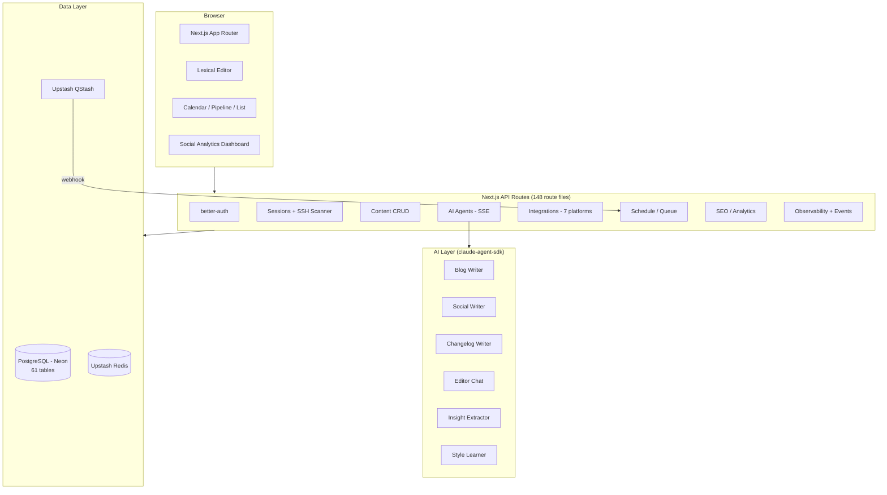
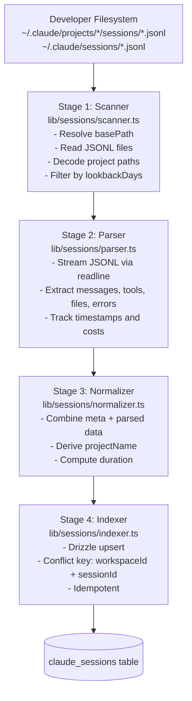
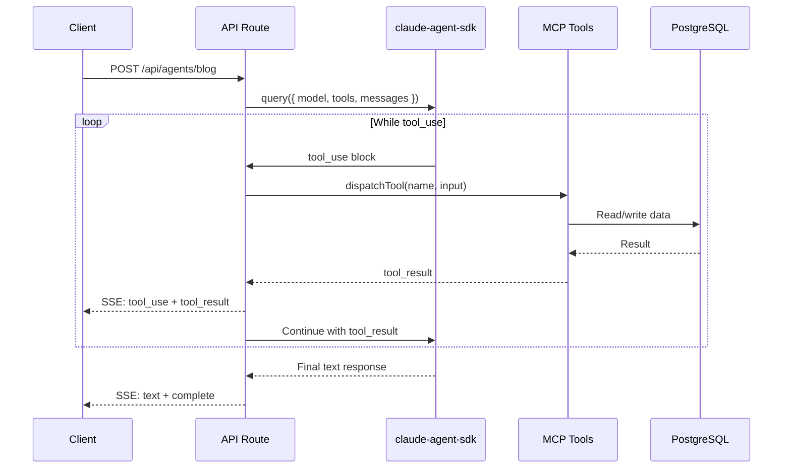
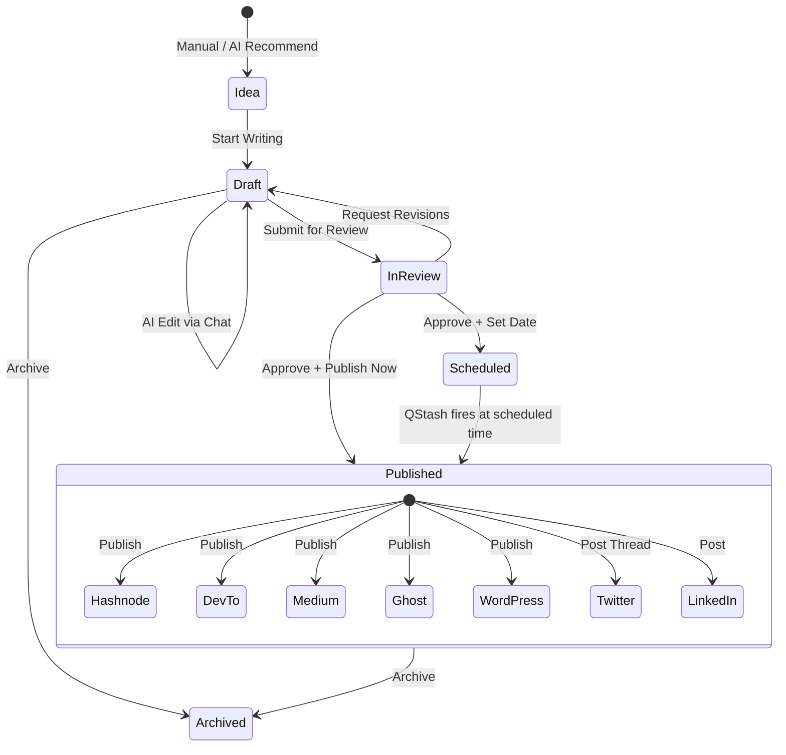
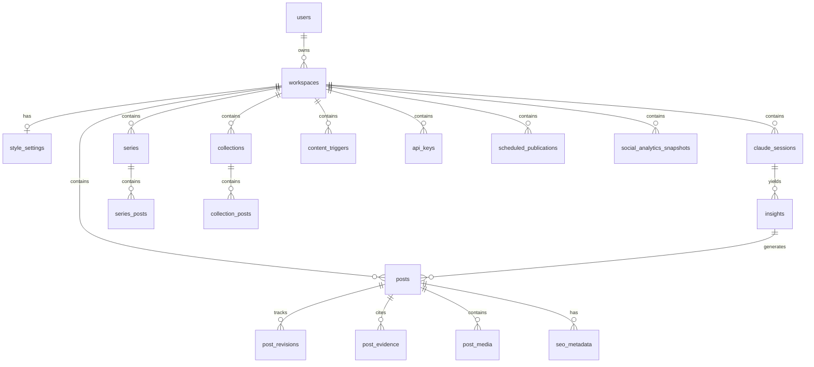
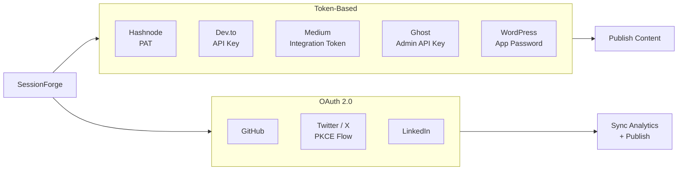

# SessionForge Architecture

**Version:** 0.5.1-alpha
**Updated:** 2026-03-09

---

## Table of Contents

1. [System Overview](#system-overview)
2. [Monorepo Structure](#monorepo-structure)
3. [Tech Stack](#tech-stack)
4. [Session Scanning Pipeline](#session-scanning-pipeline)
5. [AI Agent Pipeline](#ai-agent-pipeline)
6. [Shared Modules](#shared-modules)
7. [Content Lifecycle](#content-lifecycle)
8. [Database Schema](#database-schema)
9. [Navigation & UI](#navigation--ui)
10. [API Routes](#api-routes)
11. [Integration Architecture](#integration-architecture)
12. [Automation & Pipeline Visualization](#automation--pipeline-visualization)
13. [Key Design Decisions](#key-design-decisions)

---

## System Overview



---

## Monorepo Structure

Turborepo monorepo managed with Bun. All application code lives in `apps/`, shared packages in `packages/`.

```
sessionforge/
├── turbo.json
├── package.json
├── .env.example
├── Dockerfile / docker-compose.yml
│
├── apps/
│   └── dashboard/                      # Next.js 15 (App Router)
│       └── src/
│           ├── app/
│           │   ├── (auth)/             # Login / signup
│           │   ├── (dashboard)/[workspace]/
│           │   │   ├── sessions/       # Session browser + SSH scanner
│           │   │   ├── insights/       # Ranked insights
│           │   │   ├── content/        # Library + editor (list/calendar/pipeline)
│           │   │   ├── analytics/      # Social media analytics
│           │   │   ├── automation/     # Trigger management + pipeline runs
│           │   │   ├── observability/  # Pipeline status + visualization
│           │   │   └── settings/       # General, Style, API Keys,
│           │   │                       # Integrations, Webhooks, Sources
│           │   └── api/                # 148 route files
│           ├── components/             # React components
│           └── lib/
│               ├── sessions/           # Scanner -> Parser -> Normalizer -> Indexer
│               ├── ai/                 # Agents, tools, prompts, orchestration
│               ├── integrations/       # Platform clients
│               ├── seo/               # SEO/GEO analysis
│               ├── media/             # Diagram generation
│               └── ingestion/         # URL + repo content ingestion
│
└── packages/
    └── db/                             # Drizzle ORM schema + client
        └── src/schema.ts               # 61 tables, enums, relations
```

---

## Tech Stack

| Layer | Technology |
|---|---|
| Frontend | Next.js 15 (App Router) + React 19 + Tailwind CSS 4 |
| UI Library | shadcn/ui + flat-black design tokens |
| Editor | Lexical (rich text, markdown import/export) |
| Server State | TanStack Query v5 |
| Client State | React Context + useState |
| Auth | better-auth (email + GitHub OAuth) |
| Database | PostgreSQL via Drizzle ORM (Neon serverless) |
| Queue | Upstash QStash (scheduled job execution) |
| Cache | Upstash Redis (scan results, rate limits) |
| AI | `@anthropic-ai/claude-agent-sdk` (CLI-inherited auth, zero API keys) |
| AI Models | Claude Opus 4.5 (generation), Claude Haiku 4.5 (routing/classification) |
| Deployment | Vercel (frontend + serverless API routes) |
| Package Manager | Bun + Turborepo |

---

## Session Scanning Pipeline

The pipeline converts session data from multiple sources into structured database records.

### Local JSONL Pipeline



### SSH Session Scanner

`lib/sessions/ssh-scanner.ts` — Discovers and scans Claude sessions on remote SSH servers:
- SSH connection with key-based auth
- Find sessions in `~/.claude/projects/*/sessions/` and `~/.claude/sessions/`
- Stream JSONL files over SSH
- Parse and index into local database
- Configured via Settings > Sources tab

**Trigger points:**
- **Manual:** POST `/api/sessions/scan` from dashboard
- **Upload:** Drag-drop JSONL files on Sessions page
- **SSH Scan:** POST `/api/scan-sources/` from Sources settings
- **Scheduled:** Cron via QStash -> POST `/api/automation/execute`

---

## AI Agent Pipeline

All agents use `@anthropic-ai/claude-agent-sdk`, which inherits authentication from the Claude Code CLI session. **No API keys needed.**

### Agent Overview

| Agent | Route | Model | Output | Tools |
|---|---|---|---|---|
| `insight-extractor` | POST `/api/insights/extract` | Haiku | JSON | session, insight |
| `blog-writer` | POST `/api/agents/blog` | Opus | SSE stream | session, insight, post, skill |
| `social-writer` | POST `/api/agents/social` | Opus | SSE stream | session, insight, post |
| `changelog-writer` | POST `/api/agents/changelog` | Haiku | SSE stream | session, post |
| `newsletter-writer` | POST `/api/agents/newsletter` | Opus | SSE stream | session, post |
| `repurpose-writer` | POST `/api/agents/repurpose` | Opus | SSE stream | post, markdown |
| `evidence-writer` | POST `/api/agents/evidence` | Opus | SSE stream | session, post |
| `editor-chat` | POST `/api/agents/chat` | Opus | SSE stream | post, markdown |
| `content-strategist` | Internal | Opus | JSON | analytics, session analysis |
| `corpus-analyzer` | Internal | Opus | JSON | session corpus analysis |
| `recommendations-analyzer` | Internal | Opus | JSON | performance analysis |
| `style-learner` | Internal | Opus | JSON | workspace style analysis |

### Agentic Loop Pattern



### Tool Registry

`lib/ai/orchestration/tool-registry.ts` controls tool access per agent:

| Tool Set | Tools Exposed |
|---|---|
| `session` | `get_session_summary`, `get_session_messages`, `list_sessions_by_timeframe` |
| `insight` | `get_insight_details`, `get_top_insights`, `create_insight` |
| `post` | `create_post`, `update_post`, `get_post`, `get_markdown` |
| `markdown` | `edit_markdown`, `insert_section`, `replace_section` |
| `skill` | `list_available_skills`, `get_skill_by_name` |

### SSE Event Types

```
event: status       { phase, message }
event: tool_use     { tool, input }
event: tool_result  { tool, success, error? }
event: text         { content }
event: complete     { usage }
event: error        { message }
```

---

## Shared Modules

**Core utilities** extracted to reduce duplication across components and pages:

| Module | Exports | Used By |
|---|---|---|
| `lib/pipeline-status.ts` | `RunStatus`, `PipelineRun`, `statusBadgeClass()`, `statusLabel()` | Automation + Observability pages |
| `lib/content-constants.tsx` | `STATUS_COLORS`, `TYPE_LABELS`, `STATUS_TABS`, `SeoScoreBadge` | Content page, list view, card components |

**Content page components** (src/components/content/):
- `ExportPanel` — Export + batch operations
- `ContentListView` — Filtered post list with status tabs
- `CalendarView` — Monthly calendar grid
- `PipelineView` — Kanban-style columns

---

## Content Lifecycle



### Content Views

| View | Description |
|---|---|
| **List** | All posts with status tabs (All/Ideas/Drafts/In Review/Published/Archived), streak indicator, series/collection filtering |
| **Calendar** | Monthly grid with posts on dates, Published/Draft/AI Suggested Slot legend |
| **Pipeline** | Kanban board: Idea → Draft → In Review → Published columns with drag-and-drop |

---

## Database Schema

61 tables in PostgreSQL via Drizzle ORM. Schema at `packages/db/src/schema.ts`.

### Entity Relationship (Key Tables)



### Post Status Enum

`draft` | `published` | `archived` | `idea` | `in_review` | `scheduled`

### Insight Categories

`novel_problem_solving` | `tool_pattern_discovery` | `before_after_transformation` | `failure_recovery` | `architecture_decision` | `performance_optimization`

---

## Navigation & UI

### Sidebar (Desktop)
**Main nav:** Dashboard → Sessions → Insights → Content → Analytics → Automation → Pipeline (Observability)
**Settings:** Settings (gear icon, bottom)

### Mobile Bottom Nav (4 items + More sheet)
**Bottom bar:** Home → Sessions → Content → Automation → More (button)
**More sheet:** Insights, Analytics, Pipeline (Observability), Settings

### Middleware Redirects (Legacy route support)
- `/[workspace]/series` → `/[workspace]/content?filter=series`
- `/[workspace]/collections` → `/[workspace]/content?filter=collections`
- `/[workspace]/recommendations` → `/[workspace]/insights`
- `/[workspace]/settings/style` → `/[workspace]/settings?tab=style`
- `/[workspace]/settings/api-keys` → `/[workspace]/settings?tab=api-keys`
- `/[workspace]/settings/integrations` → `/[workspace]/settings?tab=integrations`
- `/[workspace]/settings/webhooks` → `/[workspace]/settings?tab=webhooks`
- `/[workspace]/settings/wordpress` → `/[workspace]/settings?tab=integrations`

---

## API Routes

148 route files under `apps/dashboard/src/app/api/`.

### Core Routes

| Method | Path | Description |
|---|---|---|
| GET/POST | `/api/sessions` | List / scan sessions |
| GET | `/api/sessions/[id]` | Session detail |
| GET | `/api/sessions/[id]/messages` | Raw transcript |
| GET/POST | `/api/insights` | List / extract insights |
| GET/POST/PUT/DELETE | `/api/content` | Content CRUD |
| POST | `/api/agents/blog` | Blog generation (SSE) |
| POST | `/api/agents/social` | Social content (SSE) |
| POST | `/api/agents/changelog` | Changelog (SSE) |
| POST | `/api/agents/chat` | Editor chat (SSE) |

### Scheduling & Automation

| Method | Path | Description |
|---|---|---|
| GET/POST | `/api/schedule` | Publish queue management |
| GET/POST | `/api/automation/triggers` | Trigger CRUD |
| GET/POST | `/api/automation/runs` | Pipeline run tracking |
| POST | `/api/automation/execute` | QStash webhook endpoint |
| GET | `/api/content/streak` | Publishing streak data |

### Observability & Events

| Method | Path | Description |
|---|---|---|
| GET | `/api/observability/stream` | SSE stream for real-time pipeline events |
| GET | `/api/observability/events` | Query historical observability events |

### Scan Sources

| Method | Path | Description |
|---|---|---|
| GET/POST | `/api/scan-sources` | List, add SSH scan sources |
| PUT/DELETE | `/api/scan-sources/[id]` | Update, delete source |
| POST | `/api/scan-sources/[id]/check` | Test source connectivity |

### Cron

| Method | Path | Description |
|---|---|---|
| POST | `/api/cron/automation` | Process all triggers (cron runner) |

### Integrations

| Method | Path | Description |
|---|---|---|
| GET/POST/DELETE | `/api/integrations/devto` | Dev.to API key |
| POST | `/api/integrations/devto/publish` | Publish to Dev.to |
| GET/POST/DELETE | `/api/integrations/medium` | Medium token |
| GET | `/api/integrations/medium/oauth` | Medium OAuth initiation |
| GET | `/api/integrations/medium/callback` | Medium OAuth callback |
| POST | `/api/integrations/medium/publish` | Publish to Medium |
| GET/POST/DELETE | `/api/integrations/ghost` | Ghost Admin API |
| POST | `/api/integrations/ghost/publish` | Publish to Ghost |
| GET/DELETE | `/api/integrations/github` | GitHub OAuth |
| GET | `/api/integrations/github/repos` | List GitHub repos |
| POST | `/api/integrations/github/sync` | Sync GitHub data |
| GET/DELETE | `/api/integrations/twitter` | Twitter OAuth |
| GET | `/api/integrations/twitter/oauth` | Twitter OAuth initiation |
| GET | `/api/integrations/twitter/callback` | Twitter OAuth callback |
| GET/DELETE | `/api/integrations/linkedin` | LinkedIn OAuth |
| GET | `/api/integrations/linkedin/oauth` | LinkedIn OAuth initiation |
| GET | `/api/integrations/linkedin/callback` | LinkedIn OAuth callback |
| GET/PUT | `/api/workspace/[slug]/integrations` | Hashnode PAT (via workspace settings) |

### Analytics & Content Intelligence

| Method | Path | Description |
|---|---|---|
| GET | `/api/analytics` | Social engagement metrics |
| GET | `/api/analytics/social` | Social media performance stats |
| POST | `/api/analytics/social/sync` | Sync social analytics |
| GET/POST | `/api/series` | Series CRUD |
| GET/POST | `/api/collections` | Collections CRUD |
| GET/POST | `/api/recommendations` | AI recommendations |
| GET | `/api/feed/[...slug]` | RSS/Atom feed of published content |

---

## Integration Architecture



**Token-based integrations** store credentials in per-workspace integration tables. Users paste tokens directly in Settings > Integrations.

**OAuth integrations** use redirect-based flows. Twitter uses PKCE; LinkedIn uses standard OAuth 2.0. Tokens are stored after callback and used for analytics sync and publishing.

---

## Automation & Pipeline Visualization

### Pipeline Runs

Tracks end-to-end automation execution with granular status updates:

```
Status progression: pending → scanning → extracting → generating → complete (or failed)
```

Stores in `automation_pipeline_runs` table:
- `status` — Current phase
- `sessionsScanned` — Count of indexed sessions
- `insightsExtracted` — Count of extracted insights
- `postId` — Generated content ID (if applicable)
- `durationMs` — Total execution time
- `triggerName` — Source trigger name

**Display:** Observability page shows real-time PipelineFlow visualization with status cards, historical run list, and event stream.

### Shared Instrumentation

`lib/observability/` — Event bus and instrumentation helpers:
- `event-bus.ts` — In-process EventEmitter for pipeline stages
- `instrument-query.ts` — Wrap Agent SDK queries with observability events
- `instrument-pipeline.ts` — Emit stage-transition events during scanning/extraction/generation
- `event-types.ts` — Structured event schema
- `trace-context.ts` — Distributed tracing context propagation
- `sse-broadcaster.ts` — Real-time SSE stream to frontend

---

## Key Design Decisions

### 1. CLI-Inherited AI Auth (Zero API Keys)
All AI features use `@anthropic-ai/claude-agent-sdk` which spawns the `claude` CLI subprocess. Authentication comes from the logged-in user's CLI session -- no `ANTHROPIC_API_KEY` environment variable needed. This simplifies deployment and eliminates key management.

### 2. Local JSONL over Webhook Integrations
SessionForge reads directly from `~/.claude/projects/` rather than integrating with external services for data ingestion. Self-contained, no API keys for data intake, content grounded in actual work.

### 3. Agentic Loop over Single-Shot Prompts
Multi-turn tool-use loops let agents fetch exactly the data they need and iterate, producing higher-quality output without context limit issues.

### 4. Tool Registry Pattern
Centralized tool access control per agent. Adding a new agent or tool requires only a registry entry. Enforces least-privilege (e.g., `editor-chat` cannot read sessions directly).

### 5. SSE Streaming for Content Agents
Real-time rendering of tool-use activity and partial content in the editor. Background jobs (insight extraction) use plain JSON responses.

### 6. Composite Scoring for Insight Ranking
6-dimension weighted scoring ensures technically novel, reproducible sessions surface at the top, regardless of recency.

### 7. Idempotent Scan Pipeline
Upsert with `(workspaceId, sessionId)` conflict key. Re-scanning is always safe.

### 8. Workspace-Scoped Everything
Every table scoped to `workspaceId`. Multiple workspaces per user for separating projects.

### 9. 7-Platform Integration Strategy
Token-based for simple platforms (paste and go), OAuth for platforms requiring user authorization (Twitter, LinkedIn, GitHub). Each platform has its own DB table for credentials and configuration.
